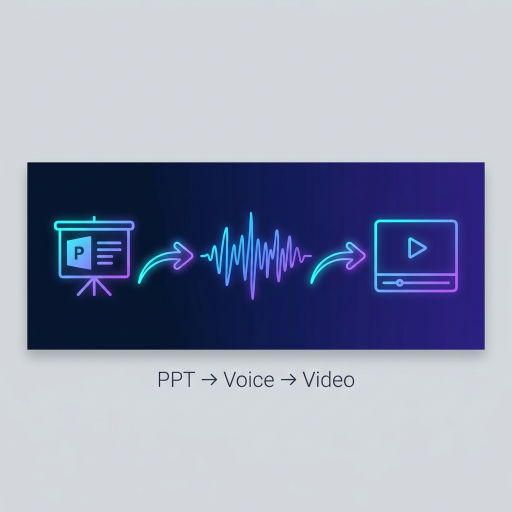

<div align="center">



# 🎬 p2v_CosyVoice

**PPT → 语音 → 视频 · 一键生成**

将带有讲稿（备注）的 PowerPoint 演示文稿，自动合成语音并渲染为完整讲解视频。
支持零样本声音克隆，只需 5 秒录音即可用自己的声音讲解 PPT。

[](https://python.org)
[](https://flask.palletsprojects.com/)
[](https://github.com/FunAudioLLM/CosyVoice)
[](LICENSE)

</div>

---

## ✨ 功能特性

| 功能 | 说明 |
|------|------|
| 📄 **PPT 自动解析** | 提取每页幻灯片图片 + 备注文本（讲稿），无需手动操作 |
| 🗣️ **高质量语音合成** | 基于 [CosyVoice2-0.5B](https://github.com/FunAudioLLM/CosyVoice) 大模型，自然流畅 |
| 🎤 **零样本声音克隆** | 上传 5-10 秒参考录音，即可用自己的声音生成讲解音频 |
| 🎨 **双视频模式** | 演播室模式（科技感背景 + PPT 叠加）/ 标准全屏模式 |
| ⚡ **多实例并行** | GPU 多实例负载均衡，自动发现可用实例，线性加速 |
| 🔄 **智能容错** | 分段级故障转移、超时重试、自动跳过故障实例 |
| 👥 **多用户隔离** | 账号系统 + 音色所有权隔离，互不干扰 |
| 📊 **实时进度** | SSE 推送四阶段进度（解析 → 合成 → 渲染 → 合并） |

---

## 🏗️ 系统架构

```
┌─────────────────────────────────────────────────────────────┐
│                       用户浏览器                             │
│              (Tailwind CSS + Vanilla JS + SSE)              │
└──────────────────────────┬──────────────────────────────────┘
                           │ HTTPS
                           ▼
┌─────────────────────────────────────────────────────────────┐
│                    Flask Web 服务 (app.py)                   │
│         用户认证 · 音色管理 · 任务调度 · 文件服务             │
└──────────┬──────────────────────────────────────────────────┘
           │ threading + asyncio
           ▼
┌─────────────────────────────────────────────────────────────┐
│              ppt2video_engine.py (异步核心引擎)              │
│                                                              │
│   PPT解析 ──→ 语音合成(并行) ──→ 视频渲染(并行) ──→ 合并     │
│   COM API     CosyVoice ×N      FFmpeg NVENC     concat     │
└──────┬──────────────┬──────────────────┬────────────────────┘
       │              │                  │
       ▼              ▼                  ▼
  PowerPoint    CosyVoice 集群      FFmpeg GPU
  COM API       (9880~9888)        h264_nvenc
```

---

## 🚀 快速开始

### 前置条件

| 依赖 | 版本要求 | 说明 |
|------|---------|------|
| Python | 3.8+ | 推荐 3.10+ |
| PowerPoint | 2019 / 2021 / 365 | 用于 PPT → 图片导出（COM API） |
| FFmpeg | 4.0+ | 需支持 NVENC 硬件编码 |
| NVIDIA GPU | 8GB+ VRAM | 推荐 A40 48GB，支持多实例 |
| CUDA | 12.0+ | GPU 驱动 470+ |
| OS | **Windows Server / Windows 10+** | 依赖 PowerPoint COM API |

### 1. 克隆仓库

```bash
git clone https://github.com/Minssnail/p2v_CosyVoice.git
cd p2v_CosyVoice
```

### 2. 安装依赖

```bash
pip install -r requirements.txt
```

> **注意**：`pywin32` 和 PowerPoint COM API 仅支持 Windows 环境。

### 3. 部署 CosyVoice 推理服务

本项目需要独立部署 [CosyVoice](https://github.com/FunAudioLLM/CosyVoice) 作为 TTS 后端。

```bash
# 在 GPU 服务器上部署 CosyVoice API 服务
# 默认监听 9880 端口，可启动多个实例 (9880, 9881, 9882, ...)
python api_server.py --port 9880
```

### 4. 配置本地环境

复制配置模板并填写实际值：

```bash
cp config_local.example.py config_local.py
```

编辑 `config_local.py`，填入你的服务器地址和密钥：

```python
FLASK_SECRET_KEY = "你的随机密钥"

COSYVOICE_SERVERS = [
    {"host": "你的GPU服务器IP", "port_range": (9880, 9888)},
]
```

> ⚠️ `config_local.py` 包含敏感信息，已在 `.gitignore` 中排除，不会被提交。

### 5. 启动服务

```bash
# 开发模式
python app.py

# 生产模式（推荐）
python run.py
```

访问 `http://localhost:5001` 即可使用。

---

## 📖 使用说明

### 基本流程

1. **注册/登录** — 首次使用需注册账号
2. **上传 PPT** — 拖拽或点击上传带有备注（讲稿）的 `.pptx` 文件
3. **选择音色** — 系统默认 / 自定义克隆音色 / 临时克隆
4. **选择视频模式** — 演播室模式（带背景）或标准全屏
5. **一键生成** — 点击按钮，实时查看四阶段进度
6. **预览下载** — 生成完毕自动跳转预览页，可在线播放或下载

### 创建自定义音色（声音克隆）

1. 点击主界面的 **「创建新音色」** 按钮
2. 输入音色名称（如 "我的声音"）
3. 准确输入参考录音中说的原话
4. 上传 5~15 秒的清晰录音（WAV / MP3）
5. 系统会自动注册到所有 CosyVoice 实例，后续可直接使用

### PPT 讲稿要求

- 在 PowerPoint 的 **备注区域** 输入每页的讲解文本
- 没有备注的页面会生成 3 秒静音过渡
- 建议每页备注控制在 50~300 字
- 超过 200 字的备注会自动智能分段

---

## ⚙️ 配置说明

### 核心配置参数

| 参数 | 文件 | 默认值 | 说明 |
|------|------|--------|------|
| `TTS_PROVIDER` | ppt2video_engine.py | `"cosyvoice"` | TTS 引擎（cosyvoice / azure / edge） |
| `COSYVOICE_SERVERS` | config_local.py | `[{"host": "..."}]` | CosyVoice 服务器列表 |
| `FLASK_SECRET_KEY` | config_local.py | — | Flask Session 密钥 |
| `AZURE_SPEECH_KEY` | config_local.py | `""` | Azure TTS 密钥（备选，可留空） |
| `MAX_RENDER_CONCURRENT` | ppt2video_engine.py | `8` | 视频渲染最大并发数 |
| `BACKGROUND_IMAGE_PATH` | ppt2video_engine.py | `static/assets/bg_tech.png` | 演播室模式背景图 |

### 视频模式

| 模式 | 说明 | 效果 |
|------|------|------|
| **演播室模式** | PPT 嵌入科技感背景中 | 专业感强，适合教学视频 |
| **标准全屏** | PPT 100% 充满画面 | 内容清晰，适合文档演示 |

---

## 📈 性能基准

> 测试环境：NVIDIA A40 (48GB VRAM) · Windows Server · 32GB RAM

| 指标 | 单实例 | 3 实例 | 5-6 实例 |
|------|--------|--------|----------|
| 单页 TTS (100字) | ~25s | ~25s | ~25s |
| 3 页总耗时 | ~70s | ~37s | ~37s |
| 10 页总耗时 | ~230s | ~80s | ~42s |
| 显存占用 (动态) | 4~6.5GB | 12~18GB | 25~30GB |
| 峰值 GPU 利用率 | ~25% | ~60% | 80-100% |

> **💡 提示**：10 页以上的 PPT 是多实例并行真正发力的场景。页数较少时，瓶颈在于最长的单页，增加实例数收益有限。

---

## 📁 项目结构

```
p2v_CosyVoice/
├── app.py                    # Flask Web 服务 (路由、认证、音色管理)
├── ppt2video_engine.py       # 异步核心引擎 (PPT解析、TTS、渲染、合并)
├── db.py                     # SQLite 数据库层 (用户、音色)
├── run.py                    # 生产环境启动脚本 (Waitress WSGI)
├── config_local.example.py   # 本地配置模板（需复制为 config_local.py）
├── config_local.py           # ⚠️ 本地敏感配置（已 gitignore，不开源）
├── requirements.txt          # Python 依赖
│
├── templates/
│   ├── login.html            # 登录/注册页面
│   ├── index.html            # 主界面 (上传、音色选择、进度)
│   └── preview.html          # 视频预览/下载页面
│
├── static/
│   ├── assets/
│   │   └── bg_tech.png       # 演播室模式背景图
│   ├── uploads/              # 用户上传文件 (PPT、音频)
│   └── outputs/              # 生成的视频文件
│
├── data/
│   └── p2v.db                # SQLite 数据库 (自动创建)
│
├── docs/                     # 文档资源
├── walkthrough.md            # 技术架构详细分析
└── 概要设计.md                # 系统概要设计文档
```

---

## 🔧 技术栈

| 层级 | 技术 | 说明 |
|------|------|------|
| **前端** | Tailwind CSS + Vanilla JS | 响应式 UI，SSE 实时通信 |
| **Web 框架** | Flask / Waitress | 单进程多线程，Session 认证 |
| **数据库** | SQLite (WAL 模式) | 零配置，支持并发读 |
| **任务引擎** | asyncio + threading | 异步 I/O + 后台线程 |
| **TTS 引擎** | CosyVoice2-0.5B (FP16) | 零样本克隆，多实例并行 |
| **TTS 备选** | Edge TTS | 系统默认音色，无需 GPU |
| **视频编码** | FFmpeg + h264_nvenc | GPU 硬件加速编码 |
| **PPT 解析** | python-pptx + COM API | 提取备注文本 + 导出高清图片 |

---

## 🛡️ 安全特性

- **密码加密存储** — SHA-256 哈希，不存储明文
- **音色所有权隔离** — `u{user_id}_{hash}` 命名规范，用户间互不可见
- **Session 认证** — `@login_required` 装饰器保护所有路由
- **账号注销** — 支持密码确认后永久删除账号及所有关联数据

---

## 🤝 贡献

欢迎提交 Issue 和 Pull Request！

1. Fork 本仓库
2. 创建特性分支 (`git checkout -b feature/amazing-feature`)
3. 提交更改 (`git commit -m 'Add amazing feature'`)
4. 推送分支 (`git push origin feature/amazing-feature`)
5. 发起 Pull Request

---

## 📄 许可证

本项目基于 [MIT License](LICENSE) 开源。

TTS 引擎 [CosyVoice](https://github.com/FunAudioLLM/CosyVoice) 遵循其原始许可证。

---

<div align="center">

**如果这个项目对你有帮助，请给一个 ⭐ Star！**

Made with ❤️ by [Minssnail](https://github.com/Minssnail)

</div>
