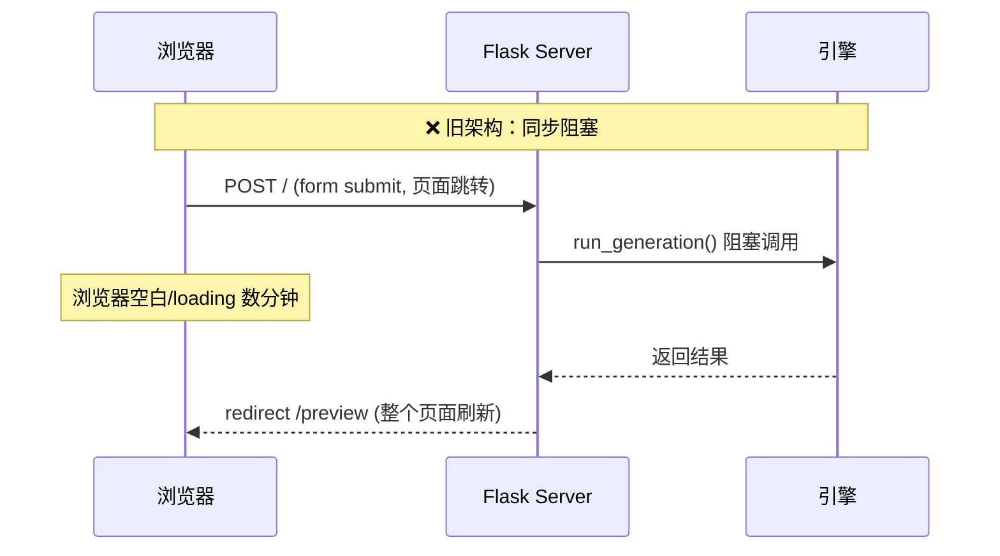
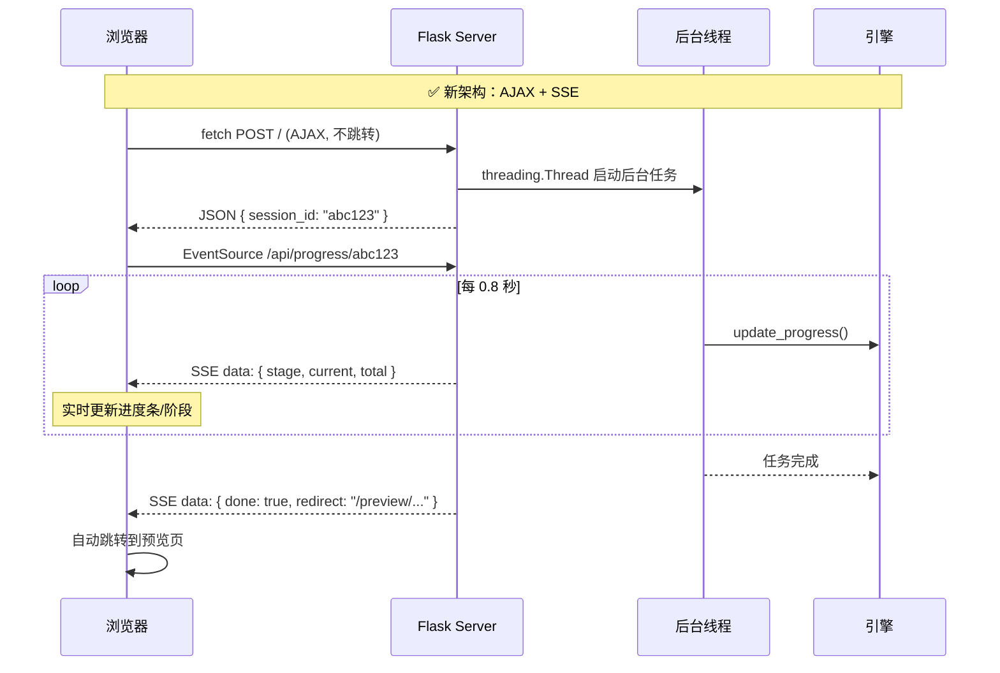
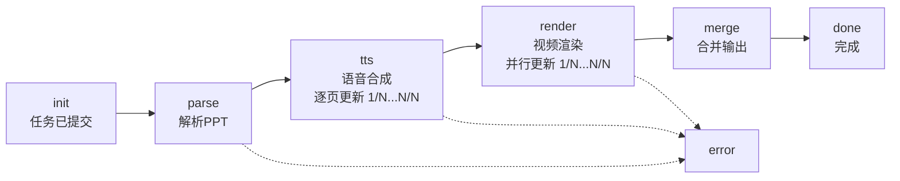

# p2v_CosyVoice AJAX 实时进度推送技术分析报告

## 1. 架构概览

本项目采用 **AJAX 异步提交 + SSE (Server-Sent Events) 服务端推送** 的架构，替代了传统的同步表单 POST。核心目标是解决视频生成过程中（通常耗时数分钟）用户无法获得任何反馈的问题。

### 新旧架构对比

````carousel

<!-- slide -->

````

---

## 2. 三层协作架构

整个系统分为三层，通过两种通信协议协作：

| 层级 | 文件 | 职责 | 运行环境 |
|------|------|------|----------|
| **前端展示层** | [index.html](file:///10.255.1.115/p2v_CosyVoice/templates/index.html) | AJAX 提交 + SSE 监听 + UI 渲染 | 浏览器 |
| **API 路由层** | [app.py](file:///10.255.1.115/p2v_CosyVoice/app.py) | 请求分发 + 线程管理 + SSE 端点 | Flask (Waitress) |
| **计算引擎层** | [ppt2video_engine.py](file:///10.255.1.115/p2v_CosyVoice/ppt2video_engine.py) | PPT 解析 + TTS + 渲染 + 进度写入 | 后台线程 (asyncio) |

---

## 3. 详细数据流分析

### 3.1 阶段一：AJAX 表单提交（前端 → 后端）

> [!IMPORTANT]
> 关键变化：`<form>` 不再使用 `action="/" method="post"`，而是通过 JS 拦截 `submit` 事件。

**前端代码**（[index.html:357-376](file:///10.255.1.115/p2v_CosyVoice/templates/index.html#L357-L376)）：
```javascript
document.getElementById('main-form').addEventListener('submit', async (e) => {
    e.preventDefault();  // ① 阻止浏览器原生提交（不跳转）
    
    const formData = new FormData(e.target);  // ② 自动序列化表单（含文件）
    
    const resp = await fetch('/', {           // ③ AJAX POST
        method: 'POST', 
        body: formData    // multipart/form-data，浏览器自动设 Content-Type
    });
    const result = await resp.json();         // ④ 解析 JSON 响应
    const sessionId = result.session_id;      // ⑤ 拿到 session_id
});
```

**后端处理**（[app.py:22-68](file:///10.255.1.115/p2v_CosyVoice/app.py#L22-L68)）：
```python
@app.route('/', methods=['GET', 'POST'])
def index():
    if request.method == 'POST':
        # ... 保存文件、解析参数 ...
        
        # 关键：不再同步调用 run_generation()
        # 而是启动后台 daemon 线程
        t = threading.Thread(target=_run_task, daemon=True)
        t.start()
        
        return jsonify({"session_id": session_id})  # 立即返回，不阻塞
```

**FormData 自动序列化的内容**：

| 字段名 | 类型 | 示例值 |
|--------|------|--------|
| `file` | File | `AI-test.pptx` |
| `voice` | string | `zero_shot` |
| `video_mode` | string | `studio` |
| `prompt_wav` | File (可选) | `teacher_voice.wav` |
| `prompt_text` | string (可选) | `大家好，今天我们来学习...` |

> [!NOTE]
> `FormData` 发送时，浏览器自动生成 `multipart/form-data` 的 `Content-Type` 头（含 boundary），**不能手动设置**，否则文件上传会失败。

---

### 3.2 阶段二：后台线程 + 进度存储（引擎 → 共享内存）

**线程安全的进度存储**（[ppt2video_engine.py:46-72](file:///10.255.1.115/p2v_CosyVoice/ppt2video_engine.py#L46-L72)）：

```python
_progress_store = {}         # 全局 dict，key=session_id
_progress_lock = threading.Lock()  # 互斥锁

def update_progress(session_id, stage, current=0, total=0, ...):
    with _progress_lock:     # 写入时加锁
        _progress_store[session_id] = { stage, current, total, ... }

def get_progress(session_id):
    with _progress_lock:     # 读取时加锁
        return _progress_store.get(session_id, {...}).copy()  # 返回副本
```

**为什么用 `threading.Lock` 而不是 `asyncio.Lock`？**

因为**写入方**（引擎）运行在 `asyncio.run()` 创建的独立事件循环中（后台线程内），而**读取方**（SSE 端点）运行在 Flask/Waitress 的同步线程中。两者不共享事件循环，所以必须用 OS 级别的 `threading.Lock`。

**进度更新时机**：



---

### 3.3 阶段三：SSE 实时推送（后端 → 前端）

**后端 SSE 端点**（[app.py:73-94](file:///10.255.1.115/p2v_CosyVoice/app.py#L73-L94)）：

```python
@app.route('/api/progress/<session_id>')
def progress_stream(session_id):
    def event_stream():
        while True:
            prog = get_progress(session_id)  # 从共享 dict 读取
            if prog.get("done"):
                prog["redirect"] = f"/preview/{task['output']}"
                yield f"data: {json.dumps(prog)}\n\n"  # SSE 格式
                break
            yield f"data: {json.dumps(prog)}\n\n"
            time.sleep(0.8)  # 轮询间隔
    
    return Response(event_stream(), 
                    mimetype='text/event-stream',       # SSE MIME
                    headers={'Cache-Control': 'no-cache',
                             'X-Accel-Buffering': 'no'})  # 禁止 Nginx 缓冲
```

> [!TIP]
> SSE 协议要求每条消息以 `data: ` 前缀开头，以 `\n\n` 结尾。浏览器的 `EventSource` API 会自动解析这个格式。

**前端 SSE 监听**（[index.html:384-396](file:///10.255.1.115/p2v_CosyVoice/templates/index.html#L384-L396)）：

```javascript
const evtSource = new EventSource(`/api/progress/${sessionId}`);

evtSource.onmessage = (event) => {
    const data = JSON.parse(event.data);  // 解析 JSON
    updateProgressUI(data);               // 更新 UI
    if (data.done) evtSource.close();     // 完成后关闭连接
};

evtSource.onerror = () => {
    evtSource.close();
    // 显示错误状态
};
```

**SSE vs WebSocket vs 轮询对比**：

| 特性 | SSE (当前方案) | WebSocket | 短轮询 |
|------|---------------|-----------|--------|
| 方向 | 服务端 → 客户端(单向) | 双向 | 客户端 → 服务端 |
| 协议 | HTTP/1.1 | ws:// | HTTP |
| 自动重连 | ✅ 浏览器原生 | ❌ 需手写 | N/A |
| 复杂度 | 低 | 高 | 最低 |
| 适用场景 | ✅ 进度推送 | 聊天/实时协作 | 简单状态查询 |

---

### 3.4 阶段四：进度百分比计算（前端 UI 逻辑）

前端根据阶段和子进度，计算加权总百分比（[index.html:291-309](file:///10.255.1.115/p2v_CosyVoice/templates/index.html#L291-L309)）：

```
总进度 = 阶段基础权重 + 阶段内子进度 × 阶段权重
```

| 阶段 | 权重 | 百分比范围 | 计算公式 |
|------|------|-----------|----------|
| parse | 10% | 0% → 10% | `10 × current / total` |
| tts | 50% | 10% → 60% | `10 + 50 × current / total` |
| render | 30% | 60% → 90% | `60 + 30 × current / total` |
| merge | 10% | 90% → 100% | `90 + 10 × current / total` |

> [!NOTE]
> 权重分配反映了实际耗时占比：TTS（语音合成）通常是最耗时的环节，因此分配了 50% 的权重。

---

## 4. 关键设计决策

### 4.1 为什么用后台线程而不是 Celery？

| 方案 | 优点 | 缺点 |
|------|------|------|
| **threading.Thread (当前)** | 零依赖、部署简单 | 不支持持久化、无法水平扩展 |
| Celery + Redis | 分布式、可持久化 | 需要额外的 Redis/RabbitMQ 服务 |

当前场景是**单机单GPU**，Thread 方案足够。

### 4.2 为什么 SSE 端点用 `time.sleep(0.8)` 轮询而不是事件驱动？

因为 Flask（WSGI）本身是同步框架，无法使用 `asyncio.Event` 这类异步原语。`time.sleep(0.8)` 是在生成器函数内，**不会阻塞其他请求**（Waitress 是多线程的，每个 SSE 连接占一个线程）。

### 4.3 `daemon=True` 的作用

后台线程设为 daemon，确保主进程退出时不会被挂起的生成任务阻塞。

---

## 5. 完整数据包追踪

以一次 10 页 PPT 的零样本克隆为例：

```
时间线    前端请求                 后端响应                    引擎状态
────────────────────────────────────────────────────────────────────
T+0s     POST / (FormData)    →  { session_id: "abc123" }     
T+0.1s   GET /api/progress/abc123                              init
T+0.8s                        ←  { stage:"parse", 0, 0 }      解析PPT中
T+3s                          ←  { stage:"parse", 10, 10 }    解析完毕
T+3.8s                        ←  { stage:"tts", 0, 10 }       开始合成
T+8s                          ←  { stage:"tts", 1, 10 }       第1页完成
T+13s                         ←  { stage:"tts", 2, 10 }       第2页完成
...                           ...
T+50s                         ←  { stage:"tts", 10, 10 }      合成完毕
T+50.8s                       ←  { stage:"render", 0, 10 }    开始渲染
T+55s                         ←  { stage:"render", 8, 10 }    并行渲染中
T+58s                         ←  { stage:"render", 10, 10 }   渲染完毕
T+58.8s                       ←  { stage:"merge", 0, 1 }      合并中
T+60s                         ←  { done:true, redirect:"/preview/abc123_output.mp4" }
T+61.5s  跳转到预览页
```
