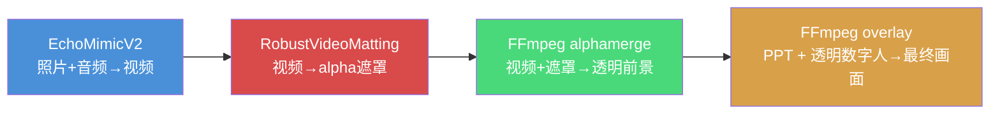
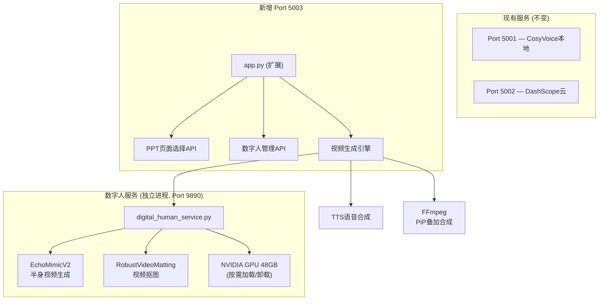
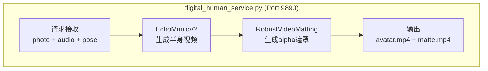
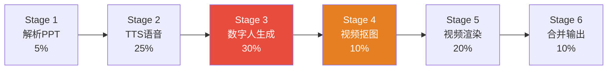

# 端口5003 半身数字人讲解PPT功能 — 实现计划 v5

## 背景

当前系统在端口5001/5002上运行PPT转视频服务。本次在**端口5003**新增半身数字人讲解功能。

**已确认需求**：
- ✅ 半身数字人定制形象，持久保存
- ✅ 支持不同姿态和表情
- ✅ PPT页面选择仅限5003端口
- ✅ GPU 48GB，与CosyVoice共用
- ✅ 视频布局：数字人**右侧全高悬浮叠加**在**演播室模式**视频画面上
- ✅ 视觉效果：轻微阴影
- ✅ 需要对数字人视频**抠图**，保留前景人物主体
- ✅ 混合渲染：选中页面 → 演播室模式+数字人，未选中页面 → 全屏模式

---

## User Review Required

> [!IMPORTANT]
> **新增关键技术环节：视频抠图（Video Matting）**
>
> 数字人悬浮叠加在PPT上，必须去除数字人视频的背景，仅保留人物主体。这需要引入**视频抠图**技术。

### 抠图方案对比

| 方案 | 技术 | 优点 | 缺点 | VRAM |
|------|------|------|------|------|
| **A. 绿幕+色度键** | EchoMimicV2纯色背景 + FFmpeg chromakey | 速度最快、无额外GPU开销、效果干净 | 绿幕溢色可能影响画质、边缘可能有毛边 | 0 |
| **B. RobustVideoMatting** ⭐推荐 | 端到端AI视频抠图模型 | 效果最好、边缘自然、头发等细节处理优秀 | 增加~500MB VRAM、增加处理时间 | ~500MB |
| **C. 双方案组合** | 绿幕生成 + RVM精修边缘 | 效果最优 | 流程稍复杂 | ~500MB |

**推荐方案B（RobustVideoMatting）**：
- GitHub 8.5k ⭐，成熟稳定
- 仅需 ~500MB VRAM（48GB中可忽略）
- 输出alpha通道，直接用于FFmpeg合成
- 对头发、手指等细节的处理远优于色度键

> [!NOTE]
> **GPU 显存分配策略（总计 48GB）**
>
> | 组件 | 峰值VRAM | 运行方式 |
> |------|----------|----------|
> | CosyVoice TTS (9880-9888) | ~4GB × N实例 | 常驻 |
> | NVENC 视频编码 | ~1GB | 按需 |
> | EchoMimicV2 | ~16-20GB | **按需加载/卸载** |
> | RobustVideoMatting | ~500MB | **按需加载** |
> | 剩余可用 | ~20GB+ | — |
>
> EchoMimicV2 采用**按需加载**策略：收到请求时加载模型，空闲超时后自动卸载释放显存，避免与CosyVoice长期争抢。

---

---

## 核心架构

### 视频合成布局（演播室模式 + 数字人右侧悬浮）

选中页面使用**演播室模式**作为底层，数字人悬浮叠加在右侧：

```
选中页面 (演播室 + 数字人)：
┌──────────────────────────────────────────┐
│  ┌────────────────────────┐  ┌────────┐ │
│  │                        │  │        │ │
│  │    PPT幻灯片            │  │ 半身   │ │
│  │   (演播室模式渲染)       │  │ 数字人 │ │
│  │    990×558 @ (38,66)   │  │(已抠图)│ │
│  │                        │  │ 轻微   │ │
│  └────────────────────────┘  │ 阴影   │ │
│        bg_tech.png 背景       │        │ │
└──────────────────────────────┴────────┘ │
└──────────────────────────────────────────┘

未选中页面 (全屏模式，无数字人)：
┌──────────────────────────────────────────┐
│                                          │
│          PPT 幻灯片 (全屏 1920×1080)       │
│           标准全屏渲染，无数字人             │
│                                          │
└──────────────────────────────────────────┘

数字人区域: ~480×1080px (宽25%, 高100%)
位置: 右侧垂直居中, padding_x=20px
效果: 轻微投影阴影 (opacity=0.15, blur=6, offset=3px)
```

> [!NOTE]
> 最终输出的视频是**混合模式**：选中数字人的页面使用演播室模式+数字人悬浮，
> 未选中的页面使用全屏模式。两种模式在一个视频中按页面交替出现。

### 抠图合成流水线



**FFmpeg 合成命令（选中页面：演播室底图 + 数字人叠加）**：
```bash
# Step 1: 演播室模式渲染 PPT (与现有studio模式相同)
ffmpeg -i bg_tech.png -i ppt_slide.png \
  -filter_complex "[1:v]scale=990:558[ppt];[0:v][ppt]overlay=38:66[studio]" \
  -map "[studio]" studio_frame.png

# Step 2: 在演播室画面上叠加抠图数字人
ffmpeg -loop 1 -i studio_frame.png \
       -i avatar_video.mp4 \
       -i alpha_matte.mp4 \
       -filter_complex "
         [1:v]scale=480:1080:force_original_aspect_ratio=decrease,
           pad=480:1080:(ow-iw)/2:(oh-ih)/2:color=0x00000000[avatar];
         [2:v]scale=480:1080:force_original_aspect_ratio=decrease,
           pad=480:1080:(ow-iw)/2:(oh-ih)/2:color=black,format=gray[matte];
         [avatar][matte]alphamerge[fg];
         [fg]split[fg1][shadow_src];
         [shadow_src]colorchannelmixer=aa=0.15,
           colorize=hue=0:saturation=0:lightness=0,
           boxblur=6:2[shadow];
         [0:v][shadow]overlay=x=W-w-20+3:y=(H-h)/2+3:shortest=1[bg_shadow];
         [bg_shadow][fg1]overlay=x=W-w-20:y=(H-h)/2:shortest=1[outv]
       " \
       -map "[outv]" -map 1:a \
       -c:v h264_nvenc -preset p1 -pix_fmt yuv420p \
       output_with_dh.mp4
```

说明：
- **选中页面**：先按演播室模式渲染PPT（叠加在bg_tech.png上），再叠加抠图数字人到右侧
- **未选中页面**：直接按现有全屏模式渲染，无数字人
- 数字人垂直居中放置在右侧（`y=(H-h)/2`），右边距20px
- 轻微阴影（opacity=0.15, blur=6, 偏移3px）

### 整体服务架构



---

## Proposed Changes

### 组件1：启动入口与配置

#### [MODIFY] [run.py](file:///e:/p2v_CosyVoice/run.py)

```python
# 新增参数
parser.add_argument('--digital-human', action='store_true',
                    help='启用数字人功能 (仅5003端口)')
parser.add_argument('--dh-provider', choices=['echomimic', 'alibaba_cloud'],
                    default='echomimic', help='数字人生成引擎')
```

- 设置环境变量 `DIGITAL_HUMAN_ENABLED` 和 `DH_PROVIDER`
- 启动命令：`python run.py --port 5003 --provider dashscope --digital-human`

#### [MODIFY] [config_local.py](file:///e:/p2v_CosyVoice/config_local.py)

```python
# === 数字人配置 ===
ECHOMIMIC_SERVER = {"host": "127.0.0.1", "port": 9890}

# 阿里云万相数字人 (备选)
ALIBABA_DH_API_KEY = ""

# 数字人右侧悬浮布局
DH_PIP_LAYOUT = {
    "avatar_width": 480,          # 数字人宽度 (像素, 画面25%)
    "avatar_height": 1080,        # 数字人高度 (全高)
    "position": "right_center",   # 右侧垂直居中
    "padding_x": 20,              # 右边距
    "shadow": True,               # 轻微阴影
    "shadow_opacity": 0.15,       # 阴影透明度 (轻微)
    "shadow_blur": 6,             # 阴影模糊半径
    "shadow_offset": 3,           # 阴影偏移量
}

# GPU 显存管理
DH_GPU_CONFIG = {
    "model_idle_timeout": 300,    # 空闲300秒后卸载模型
    "max_concurrent": 1,          # 最大并发生成数
}

# 姿态预设
DH_POSES = ["neutral", "presenting", "explaining", "thinking", "pointing", "greeting"]
```

---

### 组件2：数据库扩展

#### [MODIFY] [db.py](file:///e:/p2v_CosyVoice/db.py)

新增 `digital_humans` 表：

```sql
CREATE TABLE IF NOT EXISTS digital_humans (
    id INTEGER PRIMARY KEY AUTOINCREMENT,
    user_id INTEGER NOT NULL,
    name TEXT NOT NULL,
    original_photo_path TEXT NOT NULL,
    processed_photo_path TEXT DEFAULT '',
    thumbnail_path TEXT DEFAULT '',
    pose_variants TEXT DEFAULT '{}',    -- JSON: 姿态变体元数据
    is_default INTEGER DEFAULT 0,
    metadata TEXT DEFAULT '{}',
    created_at REAL DEFAULT (strftime('%s','now')),
    FOREIGN KEY (user_id) REFERENCES users(id) ON DELETE CASCADE
);
```

新增 6 个 CRUD 函数：`add_digital_human`, `get_user_digital_humans`, `get_digital_human`, `delete_digital_human`, `set_default_digital_human`, `get_default_digital_human`

---

### 组件3：数字人服务（新建，核心）

#### [NEW] [digital_human_service.py](file:///e:/p2v_CosyVoice/digital_human_service.py)

独立进程运行的 HTTP 服务（类似 CosyVoice 的 GPU 服务模式），**内置抠图流水线**：

```
启动: python digital_human_service.py --port 9890 --gpu 0
```

**服务内部流水线**：



**API 端点**：

| API | 方法 | 输入 | 输出 | 说明 |
|-----|------|------|------|------|
| `/api/health` | GET | — | `{status, gpu_mem_free, model_loaded}` | 健康检查 + GPU状态 |
| `/api/preprocess` | POST | `photo` (图片) | `{processed_path, thumbnail_path, face_detected}` | 人脸检测 + 裁剪 + 半身构图优化 |
| `/api/generate` | POST | `photo`, `audio`, `pose` | `{avatar_video, alpha_matte}` | **核心**：生成半身视频 + 抠图遮罩 |
| `/api/poses` | GET | — | `{poses: [...]}` | 支持的姿态列表 |
| `/api/unload` | POST | — | `{status}` | 手动卸载模型释放显存 |

**GPU 显存管理**：

```python
class GPUModelManager:
    """按需加载/卸载模型，避免与CosyVoice争抢显存"""
    
    def __init__(self, idle_timeout=300):
        self.echomimic_model = None
        self.rvm_model = None
        self.last_used = 0
        self.idle_timeout = idle_timeout  # 300秒无请求后自动卸载
        self._lock = threading.Lock()
    
    def ensure_loaded(self):
        """请求时加载模型（如未加载）"""
        with self._lock:
            if self.echomimic_model is None:
                self._load_echomimic()   # ~16GB VRAM
                self._load_rvm()         # ~0.5GB VRAM
            self.last_used = time.time()
    
    def maybe_unload(self):
        """定时检查，超时则卸载释放显存"""
        if time.time() - self.last_used > self.idle_timeout:
            self._unload_all()
    
    def _unload_all(self):
        """释放所有GPU显存"""
        del self.echomimic_model
        del self.rvm_model
        torch.cuda.empty_cache()
```

**`/api/generate` 处理流程**：

```python
@app.route('/api/generate', methods=['POST'])
def generate():
    photo = request.files['photo']      # 半身照片
    audio = request.files['audio']      # TTS音频
    pose = request.form.get('pose', 'neutral')
    
    # Step 1: 加载模型 (如未加载)
    gpu_manager.ensure_loaded()
    
    # Step 2: EchoMimicV2 生成半身说话视频
    raw_video = echomimic_generate(
        reference_image=photo_path,
        audio=audio_path,
        pose_sequence=get_pose_sequence(pose),
        width=576, height=864  # 半身比例 2:3
    )
    
    # Step 3: RobustVideoMatting 抠图
    alpha_matte = rvm_process(raw_video)
    
    # Step 4: 返回视频 + alpha遮罩
    return jsonify({
        "avatar_video": raw_video_url,
        "alpha_matte": alpha_matte_url,
        "duration": video_duration
    })
```

---

### 组件4：数字人客户端模块（新建）

#### [NEW] [digital_human.py](file:///e:/p2v_CosyVoice/digital_human.py)

Flask 端调用数字人服务 + 视频合成的客户端模块：

| 函数 | 功能 |
|------|------|
| `discover_dh_service()` | 发现并验证数字人服务可用性 |
| `preprocess_photo(photo_path)` | 调用 `/api/preprocess`，返回处理结果 |
| `generate_matted_video(photo, audio, output_dir, pose)` | 调用 `/api/generate`，获取视频+遮罩 |
| `batch_generate_matted(photo, audio_files, output_dir, poses)` | 批量生成（串行，受GPU显存限制） |
| `composite_pip(ppt_image, avatar_video, alpha_matte, audio, output, layout)` | **核心合成**：PPT + 抠图数字人 → 最终视频 |

**姿态系统**：

```python
POSE_PRESETS = {
    "neutral":    {"desc": "中性站姿", "use_for": "一般内容"},
    "presenting": {"desc": "展示姿态", "use_for": "介绍新概念"},
    "explaining": {"desc": "讲解姿态", "use_for": "详细解释"},
    "thinking":   {"desc": "思考姿态", "use_for": "分析讨论"},
    "pointing":   {"desc": "指示姿态", "use_for": "强调要点"},
    "greeting":   {"desc": "迎宾姿态", "use_for": "开场/结束"},
}

def auto_assign_poses(selected_pages: list) -> dict:
    """根据页面位置自动分配姿态"""
    poses = {}
    n = len(selected_pages)
    for i, page in enumerate(selected_pages):
        if i == 0:
            poses[page] = "greeting"
        elif i == n - 1:
            poses[page] = "neutral"
        else:
            cycle = ["presenting", "explaining", "thinking", "pointing"]
            poses[page] = cycle[(i - 1) % len(cycle)]
    return poses
```

**PiP 合成函数**：

```python
def composite_pip(ppt_image, avatar_video, alpha_matte, audio_path,
                  output_path, layout=None):
    """
    将抠图后的数字人叠加到PPT画面右侧 (全高垂直居中)
    
    FFmpeg 滤镜链:
    1. 将数字人视频缩放到右侧全高尺寸 (保持比例)
    2. 用alpha遮罩去除背景 (alphamerge)
    3. 添加轻微阴影效果
    4. 叠加到PPT画面右侧 (overlay)
    """
    avatar_w = layout.get('avatar_width', 480)
    avatar_h = layout.get('avatar_height', 1080)
    pad_x = layout.get('padding_x', 20)
    shadow_opacity = layout.get('shadow_opacity', 0.15)
    shadow_blur = layout.get('shadow_blur', 6)
    shadow_offset = layout.get('shadow_offset', 3)
    
    # 右侧垂直居中
    overlay_x = f"W-w-{pad_x}"
    overlay_y = "(H-h)/2"
    
    filter_complex = (
        # 缩放数字人视频到全高区域 (保持比例, 透明填充)
        f"[1:v]scale={avatar_w}:{avatar_h}:"
        f"force_original_aspect_ratio=decrease,"
        f"pad={avatar_w}:{avatar_h}:(ow-iw)/2:(oh-ih)/2:"
        f"color=0x00000000[avatar];"
        # 缩放遮罩到相同尺寸
        f"[2:v]scale={avatar_w}:{avatar_h}:"
        f"force_original_aspect_ratio=decrease,"
        f"pad={avatar_w}:{avatar_h}:(ow-iw)/2:(oh-ih)/2:"
        f"color=black,format=gray[matte];"
        # alphamerge: 用遮罩去除背景
        "[avatar][matte]alphamerge[fg];"
        # 轻微阴影 (固定启用)
        f"[fg]split[fg1][shadow_src];"
        f"[shadow_src]colorchannelmixer=aa={shadow_opacity},"
        f"colorize=hue=0:saturation=0:lightness=0,"
        f"boxblur={shadow_blur}:2[shadow];"
        # 先叠阴影 (偏移), 再叠前景
        f"[0:v][shadow]overlay=x={overlay_x}+{shadow_offset}:"
        f"y={overlay_y}+{shadow_offset}:shortest=1[with_shadow];"
        f"[with_shadow][fg1]overlay=x={overlay_x}:"
        f"y={overlay_y}:shortest=1[outv]"
    )
    
    cmd = [
        "ffmpeg", "-y",
        "-loop", "1", "-i", ppt_image,      # PPT幻灯片 (全屏背景)
        "-i", avatar_video,                   # 数字人视频
        "-i", alpha_matte,                    # 抠图遮罩
        "-filter_complex", filter_complex,
        "-map", "[outv]", "-map", "1:a",
        "-c:v", "h264_nvenc", "-preset", "p1",
        "-pix_fmt", "yuv420p", "-shortest",
        output_path
    ]
    subprocess.run(cmd, check=True)
```

---

### 组件5：PPT页面选择 API

#### [MODIFY] [app.py](file:///e:/p2v_CosyVoice/app.py)

新增 API 端点（**仅 `DIGITAL_HUMAN_ENABLED=1` 时注册**）：

| 端点 | 方法 | 功能 |
|------|------|------|
| `POST /api/ppt/preview` | POST | 上传PPT → 缩略图(480×270) + 讲稿 → JSON |
| `POST /api/digital-human/upload` | POST | 上传照片 → 预处理 → 保存DB → 返回数字人信息 |
| `GET /api/digital-human/list` | GET | 获取用户数字人列表 |
| `DELETE /api/digital-human/<id>` | DELETE | 删除数字人 |
| `POST /api/digital-human/<id>/default` | POST | 设为默认 |

**生成接口扩展**（`POST /`）：

```python
# 新增表单字段 (仅5003端口处理)
selected_pages = request.form.get('selected_pages', '')     # "1,3,5,7" (未勾选的页面)
dh_pages = request.form.get('dh_pages', '')                  # "1,2,4,5" (勾选数字人的页面)
digital_human_id = request.form.get('digital_human_id', '')
pose_mode = request.form.get('pose_mode', 'auto')           # auto | manual
manual_poses = request.form.get('manual_poses', '{}')       # JSON
```

---

### 组件6：视频引擎扩展

#### [MODIFY] [ppt2video_engine.py](file:///e:/p2v_CosyVoice/ppt2video_engine.py)

**新增视频模式 `"presenter"`** — 数字人讲解模式（演播室底图 + 数字人右侧悬浮）

> [!IMPORTANT]
> **混合渲染模式**：presenter模式下，每页PPT独立决定渲染方式：
> - 选中页面 → `studio` 模式渲染 + 数字人悬浮叠加
> - 未选中页面 → `default` 全屏模式渲染（无数字人）

**Pipeline 变更（6阶段）**：



> [!NOTE]
> - 阶段3+4在 `digital_human_service.py` 内部一体执行（仅对**选中页面**生成数字人+抠图）
> - 阶段5中，选中页面使用 `composite_pip()` 合成，未选中页面按原有 `default` 模式渲染

**`run_generation()` 签名扩展**：

```python
def run_generation(
    ppt_path, output_path, session_id, voice_name, video_mode,
    effect_type="random",
    # ===== 新增参数 =====
    dh_pages=None,                # List[int] | None (数字人页面列表)
    digital_human_photo=None,     # str | None (数字人照片路径)
    pose_assignments=None,        # Dict[int, str] | None
    dh_provider='echomimic',      # 'echomimic' | 'alibaba_cloud'
    pip_layout=None               # Dict | None (PiP布局参数)
):
```

**按页独立渲染逻辑**：

```python
for page_num in all_pages:
    if video_mode == "presenter" and page_num in dh_pages:
        # 选中页面: 演播室模式 + 数字人叠加
        # 1. 先按 studio 模式渲染底图 (PPT叠加在bg_tech.png上)
        studio_frame = render_studio_frame(slide_image, bg_tech)
        # 2. 叠加抠图数字人到右侧
        composite_pip(
            ppt_image=studio_frame,
            avatar_video=dh_videos[page_num],
            alpha_matte=dh_mattes[page_num],
            audio_path=audio_files[page_num],
            output_path=output_video,
            layout=pip_layout
        )
    elif video_mode == "presenter" and page_num not in dh_pages:
        # 未选中页面: 全屏模式, 无数字人
        render_slide_video(slide_image, audio, output, video_mode="default")
    else:
        # 其他模式 (studio / default): 原有逻辑不变
        render_slide_video(slide_image, audio, output, video_mode=video_mode)
```

---

### 组件7：前端 UI 更新

#### [MODIFY] [index.html](file:///e:/p2v_CosyVoice/templates/index.html)

**5步流程**（仅5003端口展示全部步骤，5001/5002保持3步不变）：

```
Step 1: 上传PPT文件 (.pptx)
Step 2: 选择配音角色
Step 3: 选择视频模式
         ├── 标准全屏 (default)
         ├── 演播室 (studio)
         └── 🧑 数字人讲解 (presenter) ✨新增
              │
              ▼ 选择后展开以下步骤:
Step 4: 选择/创建数字人形象 ✨新增
         └─ 数字人卡片列表 + 创建按钮
Step 5: PPT页面选择 ✨新增 (仅5003端口)
         └─ 左侧缩略图 + 右侧讲稿 + 勾选数字人页面
[开始生成] → 进度面板 (6阶段) → 预览
```

> [!NOTE]
> **混合渲染规则**：
> - ☑ 勾选的页面 → **演播室模式** + 数字人悬浮右侧
> - ☐ 未勾选的页面 → **全屏模式**（无数字人）
> - 无讲稿的页面自动标灰，不可勾选（无音频则无法生成数字人）

##### ① 数字人选择面板（Step 4，选择"数字人讲解"模式后出现）

```
┌──────────────────────────────────────────────┐
│  🧑 选择数字人形象                  [+ 创建新数字人] │
│                                              │
│  ┌────────┐  ┌────────┐  ┌────────┐         │
│  │  📷    │  │  📷    │  │  📷    │         │
│  │ 半身照 │  │ 半身照 │  │ 半身照 │         │
│  │"小明"  │  │"小红"  │  │"小李"  │         │
│  │ ✓ 选中 │  │        │  │        │         │
│  │  🗑 删除│  │  🗑 删除│  │  🗑 删除│         │
│  └────────┘  └────────┘  └────────┘         │
│                                              │
│  💡 提示: 请上传正面或微侧面的半身照片,          │
│     光线均匀, 背景简洁                         │
└──────────────────────────────────────────────┘
```

##### ② PPT页面选择器（Step 5，左侧缩略图 + 右侧讲稿）

```
┌────────────────────────────────────────────────────────────────┐
│  📑 选择需要数字人讲解的PPT页面            [全选] [取消全选]      │
│  ☑ 勾选 = 演播室+数字人  |  ☐ 未勾选 = 全屏模式                 │
│                                                                │
│  ┌────────────────────────────────────────────────────────────┐ │
│  │ ☑ │ ┌──────────┐ │ 第1页                                  │ │
│  │   │ │          │ │ 讲稿:                                   │ │
│  │   │ │  缩略图   │ │ 大家好，今天我来分享关于人工智能的最新     │ │
│  │   │ │  480×270  │ │ 进展。人工智能正在深刻改变我们的生活方式    │ │
│  │   │ │          │ │ 和工作模式，让我们一起来看看...            │ │
│  │   │ └──────────┘ │ 姿态: 👋 迎宾                           │ │
│  ├───┼──────────────┼────────────────────────────────────────┤ │
│  │ ☑ │ ┌──────────┐ │ 第2页                                  │ │
│  │   │ │          │ │ 讲稿:                                   │ │
│  │   │ │  缩略图   │ │ 首先，让我们了解一下深度学习的基本原理。   │ │
│  │   │ │          │ │ 深度学习是机器学习的一个分支...            │ │
│  │   │ └──────────┘ │ 姿态: 👉 展示                           │ │
│  ├───┼──────────────┼────────────────────────────────────────┤ │
│  │ ☐ │ ┌──────────┐ │ 第3页                                  │ │
│  │   │ │          │ │ (无讲稿)                                │ │
│  │   │ │  缩略图   │ │                                        │ │
│  │   │ │  [灰色]   │ │ ⚠️ 此页无讲稿，将使用全屏模式静默展示3秒   │ │
│  │   │ └──────────┘ │                                        │ │
│  └───┴──────────────┴────────────────────────────────────────┘ │
│                                                                │
│  已勾选 10/15 页添加数字人    姿态: ● 自动分配  ○ 手动选择        │
└────────────────────────────────────────────────────────────────┘
```

- 每行一个PPT页面：左侧复选框+缩略图，右侧讲稿全文+姿态
- 无讲稿的页面标灰且不可勾选
- 底部显示已勾选数量 + 姿态模式切换
- 手动模式下每页可选择姿态下拉菜单

##### ③ 进度面板（6阶段）

```
解析 → TTS → 数字人生成 → 视频抠图 → 视频渲染 → 合并
 ✓     ✓      ◉ 3/10      ○          ○        ○
```

进度权重：解析5% + TTS 25% + 数字人30% + 抠图10% + 渲染20% + 合并10%

> [!NOTE]
> 数字人生成阶段仅处理勾选的页面数（如10/15页）。
> 渲染阶段处理所有页面（勾选页用studio+DH，未勾选页用fullscreen）。

---

## 文件变更汇总

| 操作 | 文件 | 变更说明 |
|------|------|----------|
| MODIFY | [run.py](file:///e:/p2v_CosyVoice/run.py) | 增加 `--digital-human`, `--dh-provider` 参数 |
| MODIFY | [config_local.py](file:///e:/p2v_CosyVoice/config_local.py) | PiP布局、GPU管理、姿态预设配置 |
| MODIFY | [db.py](file:///e:/p2v_CosyVoice/db.py) | 新增 `digital_humans` 表 + 6个CRUD函数 |
| **NEW** | [digital_human_service.py](file:///e:/p2v_CosyVoice/digital_human_service.py) | EchoMimicV2 + RVM 抠图 HTTP服务（独立进程） |
| **NEW** | [digital_human.py](file:///e:/p2v_CosyVoice/digital_human.py) | 客户端模块：服务调用 + PiP合成 + 姿态系统 |
| MODIFY | [app.py](file:///e:/p2v_CosyVoice/app.py) | 5个新API端点 + 生成接口扩展 |
| MODIFY | [ppt2video_engine.py](file:///e:/p2v_CosyVoice/ppt2video_engine.py) | presenter模式、页面选择、6阶段流水线 |
| MODIFY | [templates/index.html](file:///e:/p2v_CosyVoice/templates/index.html) | 数字人面板、PPT选择器、6阶段进度 |
| MODIFY | [requirements.txt](file:///e:/p2v_CosyVoice/requirements.txt) | Pillow, opencv-python |

---

## Verification Plan

### Automated Tests
```bash
# 1. 服务启动验证
python digital_human_service.py --port 9890 --gpu 0
curl http://localhost:9890/api/health

# 2. 照片预处理测试
curl -X POST -F "photo=@test_half_body.jpg" http://localhost:9890/api/preprocess

# 3. 数字人生成+抠图测试
curl -X POST -F "photo=@test.jpg" -F "audio=@test.wav" \
     -F "pose=neutral" http://localhost:9890/api/generate

# 4. PPT预览API测试
python run.py --port 5003 --provider dashscope --digital-human &
curl -X POST -F "file=@0518.pptx" http://localhost:5003/api/ppt/preview

# 5. 验证5001/5002不受影响
curl http://localhost:5001/
curl http://localhost:5002/
```

### Manual Verification
1. ✅ 5001、5002端口功能完全不受影响
2. ✅ 5003端口展示完整数字人UI（5001/5002不展示）
3. ✅ 上传半身照创建数字人，预处理+缩略图正常
4. ✅ 数字人持久保存，重启后仍在
5. ✅ PPT页面列表正确展示（左侧缩略图+右侧讲稿）
6. ✅ **勾选页面使用演播室模式+数字人，未勾选页面使用全屏模式**
7. ✅ **视频中数字人已正确抠图，无背景残留，悬浮在演播室画面右侧**
8. ✅ 数字人口型与语音同步，不同页面姿态有变化
9. ✅ 混合模式视频播放流畅，两种模式切换自然
10. ✅ 进度面板6阶段正确显示
11. ✅ GPU显存在空闲后正确释放

---

## 实施阶段

### 阶段1 — 基础设施（约0.5天）
- [ ] `run.py` 启动参数
- [ ] `config_local.py` 配置项
- [ ] `db.py` digital_humans 表 + CRUD
- [ ] `requirements.txt` 更新

### 阶段2 — 数字人服务（约2天）
- [ ] 搭建 EchoMimicV2 环境 + 下载模型
- [ ] 搭建 RobustVideoMatting 环境 + 下载模型
- [ ] `digital_human_service.py` — HTTP API + GPU管理 + 抠图流水线
- [ ] 独立测试：照片→半身视频→抠图→透明前景

### 阶段3 — PPT选择 + 数字人管理（约1.5天）
- [ ] `app.py` — PPT预览API + 数字人CRUD API
- [ ] `digital_human.py` — 客户端模块 + PiP合成函数 + 姿态系统
- [ ] `index.html` — 数字人面板 + PPT选择器 + 姿态UI

### 阶段4 — 视频引擎集成 + 联调（约2天）
- [ ] `ppt2video_engine.py` — presenter模式 + 6阶段 + selected_pages
- [ ] `index.html` — 6阶段进度面板
- [ ] 端到端联调 + GPU显存监控
- [ ] Bug修复 + 边界情况处理
