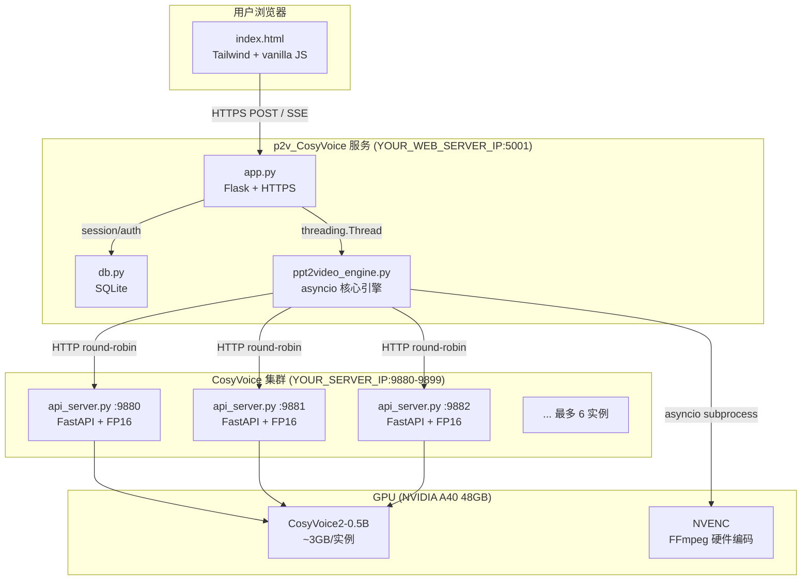
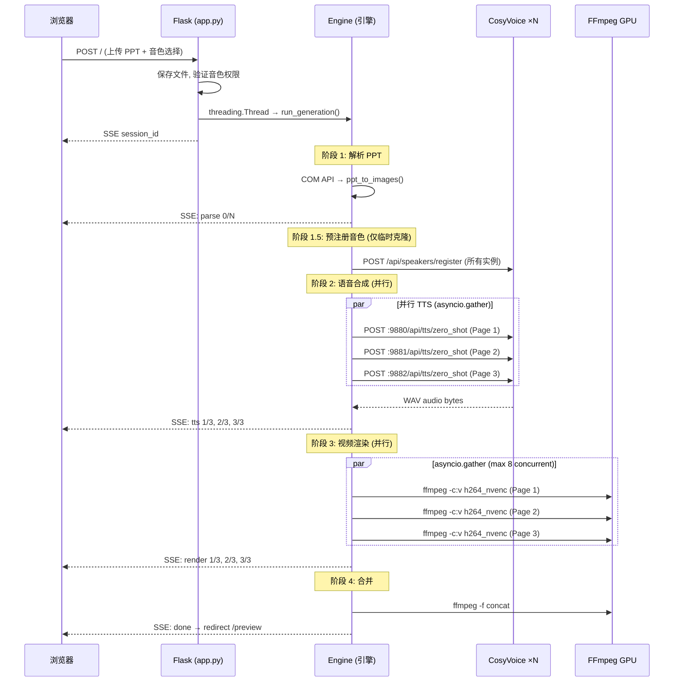
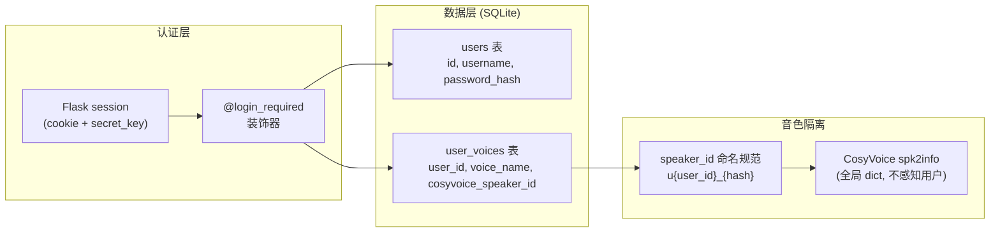

# PPT语音视频生成系统 — 技术架构分析

## 系统总览



---

## 服务拓扑

| 服务 | 地址 | 框架 | 进程模型 | 职责 |
|------|------|------|---------|------|
| **p2v_CosyVoice** | `https://YOUR_WEB_SERVER_IP:5001` | Flask (dev) / Waitress (prod) | 单进程多线程 | Web 前端、用户管理、任务调度、视频渲染 |
| **CosyVoice API ×N** | `http://YOUR_SERVER_IP:9880-9899` | FastAPI + uvicorn | 每实例单进程 | TTS 推理 (FP16) |
| **SQLite** | `data/p2v.db` | 嵌入式 | WAL 模式 | 用户账号、音色元数据 |

---

## 数据流

### PPT → 视频 完整流水线



---

## GPU 并行策略

### 多实例负载均衡

```
┌─────────────────────── A40 GPU (48GB VRAM) ───────────────────────┐
│                                                                    │
│  ┌──────────┐  ┌──────────┐  ┌──────────┐                        │
│  │ :9880    │  │ :9881    │  │ :9882    │  ... 最多 6 实例        │
│  │ ~3GB     │  │ ~3GB     │  │ ~3GB     │  (受 32GB RAM 限制)    │
│  │ FP16     │  │ FP16     │  │ FP16     │                        │
│  └──────────┘  └──────────┘  └──────────┘                        │
│                                                                    │
│  ┌──────────────── NVENC (硬件编码) ──────────────────┐           │
│  │  FFmpeg h264_nvenc × 8 concurrent                  │           │
│  └────────────────────────────────────────────────────┘           │
│                                                                    │
│  已用: ~12GB (3实例)          空闲: ~36GB                         │
└────────────────────────────────────────────────────────────────────┘
```

### 自动扩缩容机制

| 组件 | 机制 |
|------|------|
| **start_multi.py** | 启动时查询 `nvidia-smi` + `wmic`，计算 `min(VRAM能力, RAM能力, 硬上限6)` |
| **ppt2video_engine.py** | 每个任务开始时扫描端口 9880-9899，自动发现活跃实例 |
| **并发控制** | `asyncio.Semaphore(N)` 确保并发数 = 实例数，轮询分配 |

---

## 用户管理架构



### 音色所有权验证流程

```
用户选择音色 → app.py 检查 user_voices 表
    ├── u{id}_ 前缀 → 验证 user_id 匹配 → ✅ 放行
    ├── zh-CN-* 前缀 → 系统默认 Edge TTS → ✅ 放行
    └── zero_shot → 临时克隆模式 → ✅ 放行 (用 p2v_{session} 前缀注册)
```

---

## 技术栈明细

| 层级 | 技术 | 版本/说明 |
|------|------|----------|
| **前端** | Tailwind CSS (CDN) | 响应式 UI |
| | Vanilla JS | SSE + FormData + DOM 操控 |
| **Web 框架** | Flask | 单进程, session 认证 |
| **数据库** | SQLite3 | WAL 模式, 零依赖 |
| **任务引擎** | asyncio + threading | 异步 I/O + 后台线程 |
| **TTS 引擎** | CosyVoice2-0.5B | FP16, 零样本克隆 |
| **TTS 备选** | Edge TTS | 系统默认音色 (无需 GPU) |
| **TTS API** | FastAPI + uvicorn | 多实例, CORS |
| **视频编码** | FFmpeg + h264_nvenc | GPU 硬件加速 |
| **PPT 解析** | python-pptx + COM API | 提取备注 + 导出图片 |
| **GPU** | NVIDIA A40 (48GB) | CUDA 12.4, TCC 模式 |
| **OS** | Windows Server | 32GB RAM |

---

## 性能基准

| 指标 | 单实例 | 3 实例 | 6 实例 |
|------|--------|--------|--------|
| 单页 TTS (100字) | ~25s | ~25s | ~25s |
| 3 页总耗时 | ~70s | ~37s | ~37s |
| 10 页总耗时 | ~230s | ~80s | ~42s |
| 显存占用 | 3.1GB | 9.3GB | 18.6GB |
| 系统 RAM | ~3GB | ~9GB | ~18GB |
| GPU 利用率 | ~22% | ~40% | ~55% |

> [!NOTE]
> 10 页以上的 PPT 是多实例真正发力的场景。3 页时瓶颈是最长的那一页，实例数增加收益有限。

---

## 关键设计决策

| 决策 | 选择 | 原因 |
|------|------|------|
| TTS 并行 | 多进程实例 vs 单进程多线程 | CosyVoice 内部有 `self.lock`，单进程并发无意义 |
| FP16 | 默认开启 | A40 Tensor Core 原生支持，速度 1.5x，显存减半 |
| 音色隔离 | p2v 端命名规范 vs CosyVoice 端改造 | 零侵入，CosyVoice 无需修改 |
| 进度推送 | SSE vs WebSocket | Flask 同步框架，SSE 更简单，轮询 0.8s |
| 视频编码 | NVENC vs CPU | GPU 空闲时硬件编码几乎零开销 |
| 用户存储 | SQLite vs MySQL | 单机部署，零配置，WAL 模式支持并发读 |
