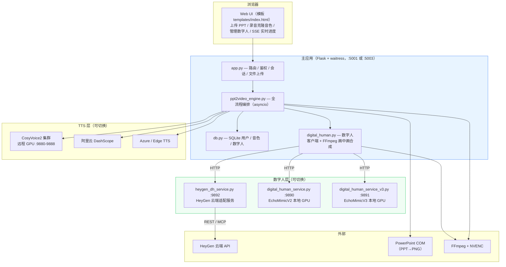
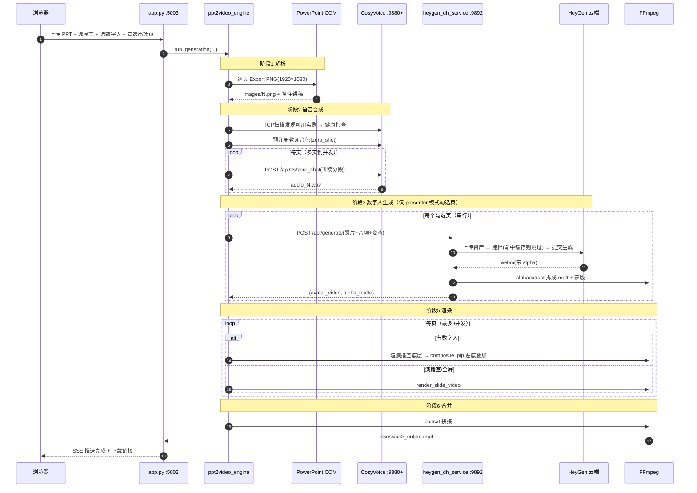
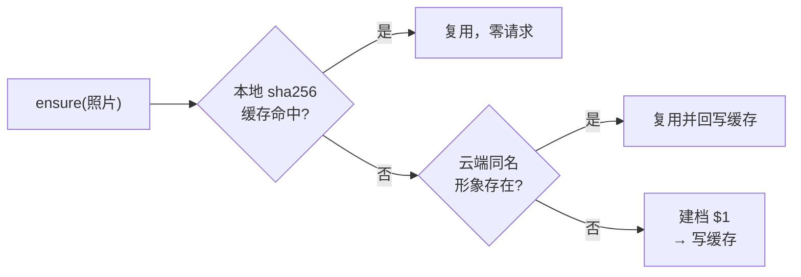

# p2v_CosyVoice 项目说明文档

> **一句话**：把带讲稿备注的 PPT，自动合成为「教师本人声音 + 数字人出镜」的讲解微课视频。
>
> **文档版本**：v1.0 ｜ **更新日期**：2026-09-04
> **适用对象**：需要复现、部署或二次开发本系统的工程师

---

## 目录

1. [系统能做什么](#一系统能做什么)
2. [整体技术架构](#二整体技术架构)
3. [端口与服务清单](#三端口与服务清单)
4. [核心处理流程](#四核心处理流程)
5. [数字人子系统（HeyGen 云端）](#五数字人子系统heygen-云端)
6. [环境准备与部署](#六环境准备与部署)
7. [配置文件详解](#七配置文件详解)
8. [启动与运行](#八启动与运行)
9. [用户使用说明](#九用户使用说明)
10. [数据库结构](#十数据库结构)
11. [成本说明](#十一成本说明)
12. [故障排查](#十二故障排查)
13. [已知限制与注意事项](#十三已知限制与注意事项)
14. [目录结构](#十四目录结构)

---

## 一、系统能做什么

输入一个 `.pptx` 文件（每页在**备注栏**写好讲稿），系统自动完成：

| 环节 | 说明 |
| :--- | :--- |
| **PPT 解析** | 逐页导出 1920×1080 PNG + 提取备注栏讲稿文本 |
| **语音合成** | 用教师本人声音（零样本克隆，5–10 秒录音即可）朗读讲稿 |
| **数字人生成** | 用教师照片生成口型同步的数字人视频（可选） |
| **视频渲染** | 三种画面模式：全屏 / 演播室 / 演播室+数字人 |
| **合并输出** | 拼接为一个完整的 MP4 微课 |

**三种视频模式**

| 模式 | 画面 | 适用 |
| :--- | :--- | :--- |
| `default` 标准全屏 | PPT 铺满画面 + 转场特效 | 纯内容讲解 |
| `studio` 演播室 | 科技感背景 + PPT 嵌入屏幕框 | 提升观感 |
| `presenter` 数字人讲解 | 演播室 + **右侧贴底数字人** | 拟真授课 |

> `presenter` 模式支持**按页选择**：只在你勾选的页面叠加数字人，其余页面自动用演播室模式渲染。

---

## 二、整体技术架构

### 2.1 分层结构



### 2.2 关键设计：数字人引擎可插拔

三个数字人服务对上游暴露**字段级同构**的 HTTP 契约，切换引擎只需改一个配置项，主应用代码零改动：

```
digital_human.py::_service_url()
    ECHOMIMIC_ENGINE = "v2"      → :9890  EchoMimicV2（本地 GPU）
    ECHOMIMIC_ENGINE = "v3"      → :9891  EchoMimicV3（本地 GPU）
    ECHOMIMIC_ENGINE = "heygen"  → :9892  HeyGen 云端（当前生产配置）
```

统一契约：

```
GET  /api/health       服务状态
POST /api/preprocess   照片预处理（HeyGen 下会同时完成云端建档）
POST /api/generate     照片 + 音频 → 数字人视频 + alpha 蒙版
GET  /api/poses        姿态列表
POST /api/unload       卸载模型（云端服务为空操作）
```

**返回值必须包含**：`avatar_video`（彩色轨本地路径）+ `alpha_matte`（灰度蒙版本地路径），供 `composite_pip()` 做 alphamerge 合成。

### 2.3 技术栈

| 层 | 技术 |
| :--- | :--- |
| Web | Flask + waitress（生产级 WSGI）+ Tailwind CSS（CDN） |
| 异步编排 | asyncio + aiohttp（TTS 多实例并发） |
| 数据库 | SQLite（`data/p2v.db`） |
| PPT 解析 | `win32com`（PowerPoint COM 自动化，**Windows 限定**） |
| 视频处理 | FFmpeg（`h264_nvenc` 硬件编码，回落 `libx264`） |
| TTS | CosyVoice2-0.5B（自建）/ DashScope / Azure / Edge |
| 数字人 | HeyGen Avatar III/IV/V（云端）或 EchoMimicV2/V3（本地） |
| 进度推送 | SSE（Server-Sent Events） |

---

## 三、端口与服务清单

| 端口 | 服务 | 进程 | 必需性 |
| :--- | :--- | :--- | :--- |
| **5001** | 主应用（无数字人） | `run.py --port 5001` | 二选一 |
| **5003** | 主应用（**启用数字人**） | `run.py --port 5003 --digital-human` | 二选一 |
| **9880–9888** | CosyVoice2 TTS 集群 | 远程 GPU 机，独立部署 | TTS 用 cosyvoice 时必需 |
| **9890** | EchoMimicV2 数字人 | `digital_human_service.py` | 可选（本地 GPU 方案） |
| **9891** | EchoMimicV3 数字人 | `digital_human_service_v3.py` | 可选（本地 GPU 方案） |
| **9892** | HeyGen 云端适配服务 | `heygen_dh_service.py` | **当前生产方案** |
| 9893 | 预留 | — | — |
| 6274 | HeyGen MCP OAuth 回调 | 一次性授权时临时占用 | 仅 MCP 模式 |

> **最小可运行组合**：5003（主应用）+ 9892（数字人）+ 至少一个 CosyVoice 实例。
> 9890/9891 是历史方案，不启动不影响 HeyGen 路线。

---

## 四、核心处理流程



### 4.1 六个阶段与进度权重

| 阶段 | 标识 | presenter 模式权重 |
| :--- | :--- | :--- |
| 解析 PPT | `parse` | 5% |
| 语音合成 | `tts` | 25% |
| 数字人生成 | `dh_generate` | 30% |
| 视频抠图 | `matting` | 10% |
| 视频渲染 | `render` | 20% |
| 合并输出 | `merge` | 10% |

### 4.2 演播室 + 数字人的合成细节

```
① render_slide_video(video_mode="studio")
   背景图 bg_tech.png(1280×800) + PPT 缩放至 990×558 叠加到 (38,66) 屏幕框
   ↓ studio 底层视频

② composite_pip(base_video=studio底层)
   数字人视频 ─┐
   alpha蒙版  ─┴→ alphamerge → 阴影层 → overlay 到右侧贴底 → h264_nvenc
   ↓ 单页成片
```

**数字人贴底的关键**（`digital_human.py::composite_pip`）：

数字人源视频是 9:16 竖版，按比例缩进 480×1080 框后实际约 480×853，剩余高度由 `pad` 补透明像素。若用 `(oh-ih)/2` 垂直居中，人物下方会多出上百像素透明边——视觉上就是"脚不沾地"。因此：

| 参数 | 值 | 作用 |
| :--- | :--- | :--- |
| pad 垂直偏移 | `(oh-ih)` | 内容沉到框底 |
| `overlay_y` | `H-h-padding_y` | 框贴画面底边 |
| `vertical_align` | `"bottom"` | 配置开关（`"center"` 回退旧行为） |

> ⚠️ 蒙版必须与彩色轨用**完全相同**的对齐方式，否则抠像错位。

---

## 五、数字人子系统（HeyGen 云端）

### 5.1 Provider 三选一

`heygen_dh_service.py` 内部通过 `HEYGEN_CONFIG["provider"]` 切换：

| Provider | 认证 | 计费 | 能否建档 | 用途 |
| :--- | :--- | :--- | :--- | :--- |
| `mock` | 无 | **0** | ✅（本地伪造） | 开发联调 / CI 回归，不联网 |
| `rest` | API Key | **API 钱包 USD** | ✅ | **当前生产方案** |
| `mcp` | OAuth 2.1+PKCE | 网页版包月 credits | ❌ 免费版被 403 | 备选 |

> **实测结论（2026-08-19）**：HeyGen **网页版免费账号**调用 `create_photo_avatar` 会被套餐网关直接拒绝
> （`403 forbidden: Avatar creation requires a paid plan`），**与钱包余额无关**，MCP/REST 皆然。
> 必须开通 API 服务（钱包计费）才能通过接口建档。

### 5.2 内部组件

```
heygen/
├── provider_base.py     Provider 抽象接口 + HeyGenError（status/code 语义化）
├── provider_rest.py     v3 REST + API Key   ← 生产
├── provider_mcp.py      MCP JSON-RPC + OAuth
├── provider_mock.py     本地 FFmpeg 伪造产物（零成本）
├── oauth_mcp.py         OAuth PKCE 客户端 + token 自动刷新
├── avatar_registry.py   照片指纹 → avatar_id 缓存（防重复建档）
├── voice_registry.py    音频指纹 → voice_id 缓存
├── credit_guard.py      余额护栏 / 免费版配额账本
├── media_adapter.py     webm(alpha)→mp4+蒙版、绿幕抠像、蒙版自检
├── task_manager.py      线程池 + 并发闸门 + 任务状态机
└── pose_map.py          姿态 → motionPrompt 映射
```

### 5.3 防重复建档（三层，每次建档 $1）



1. **本地 sha256 缓存**（`heygen_avatars.json`）：按**照片字节指纹**索引，与文件路径无关
2. **云端同名查重**：缓存失效时按名称查询账号已有形象，命中则复用
3. **命名统一**：`/api/preprocess` 与 `/api/generate` 均用「照片文件名去扩展名」作为形象名

> 命名不统一曾导致同一张照片在 HeyGen 后台建出两个形象（浪费 $1）。两处调用点必须保持一致。

### 5.4 关键 API 端点（实测确认）

```
GET  /v3/users/me                    账号 + 钱包余额
POST /v3/assets                      资产上传（必须 multipart，字段名 file）
POST /v3/avatars                     建档（type=photo）
GET  /v3/avatars?ownership=private   私有形象列表
GET  /v3/avatars/looks/{lookId}      look 详情（含 supported_api_engines）
POST /v3/videos                      提交生成
GET  /v3/videos/{videoId}            查询状态
```

**踩过的坑**：

| 坑 | 现象 | 正解 |
| :--- | :--- | :--- |
| 建档响应结构 | 按 `id`/`avatar_id` 平铺字段取值全落空 → 502，但云端**已扣费** | id 在 `data.avatar_item.id` |
| 资产上传 | PUT 裸字节 → 400 `invalid_parameter` | multipart，字段名 `file` |
| look 路径 | `/v3/avatar-looks/{id}`、`/v3/avatars/{id}/looks` 均 404 | `/v3/avatars/looks/{id}` |
| MCP 响应 | `resp.json()` 抛 `JSONDecodeError` | 是 SSE（`text/event-stream`），需解析 `data:` 行 |
| VP9 alpha | 蒙版全白 → 数字人成不透明方块 | 解码必须显式 `-c:v libvpx-vp9` |
| alpha 判定 | WebM 的 VP9 alpha 时 `pix_fmt` 仍报 `yuv420p` | 兼看容器 `alpha_mode=1` 标记 |

---

## 六、环境准备与部署

### 6.1 硬性前提

| 项 | 要求 | 原因 |
| :--- | :--- | :--- |
| **操作系统** | **Windows** | PPT 转图片依赖 PowerPoint COM 自动化 |
| **Microsoft PowerPoint** | 已安装并可正常启动 | 同上 |
| **Python** | 3.10+（实测 3.14） | 使用了 `X \| None` 等新语法 |
| **FFmpeg** | 在 PATH 中，需支持 `libvpx-vp9` | 视频合成 + alpha 拆分 |
| **NVIDIA GPU**（可选） | 支持 `h264_nvenc` | 加速编码，无则自动回落 `libx264` |

验证 FFmpeg：

```powershell
ffmpeg -decoders | findstr vp9      # 必须有 libvpx-vp9
ffmpeg -encoders | findstr nvenc    # 有则用硬编，无则 libx264
```

### 6.2 安装依赖

```powershell
conda create -n p2v python=3.12
conda activate p2v
pip install -r requirements.txt
```

`requirements.txt`：

```
flask, waitress, requests, httpx, edge-tts,
python-pptx, pywin32, azure-cognitiveservices-speech,
Pillow, opencv-python
```

> `opencv-python` 对 9892 服务是**可选**的——缺失时仅跳过人脸检测，不影响主链路。

### 6.3 CosyVoice TTS 集群（独立部署）

TTS 服务需在**另一台 GPU 机**上部署，暴露 `POST /api/tts/zero_shot`，端口段 9880–9888。
参见 `COSYVOICE_START_GUIDE.md`。主应用通过 TCP 端口扫描 + 健康检查自动发现可用实例。

> 若不自建 CosyVoice，可改用 `--provider dashscope`（阿里云百炼）或 `azure` / `edge`。

### 6.4 HeyGen 账号准备

1. 注册 HeyGen 并**开通 API 服务**（必须，免费网页版无法通过接口建档）
2. 在 HeyGen 控制台获取 API Key（形如 `sk_V2_...`）
3. 确保 API 钱包有余额

---

## 七、配置文件详解

复制模板后填写：

```powershell
copy config_local.example.py config_local.py
```

> `config_local.py` 已在 `.gitignore` 中，**不会被提交**。所有密钥只放这里。

### 7.1 基础配置

```python
FLASK_SECRET_KEY = "替换为随机字符串"

# CosyVoice 集群（主应用自动扫描此范围内的活跃实例）
COSYVOICE_SERVERS = [
    {"host": "10.x.x.x", "port_range": (9880, 9888)},
]

# 阿里云百炼（provider=dashscope 时用）
DASHSCOPE_API_KEY = "sk-..."
DASHSCOPE_MODEL = "cosyvoice-v3.5-plus"
```

### 7.2 数字人引擎选择

```python
ECHOMIMIC_ENGINE = "heygen"   # "v2" | "v3" | "heygen"

ECHOMIMIC_SERVER    = {"host": "127.0.0.1", "port": 9890}
ECHOMIMIC_V3_SERVER = {"host": "127.0.0.1", "port": 9891}
HEYGEN_SERVER       = {"host": "127.0.0.1", "port": 9892}
```

### 7.3 HeyGen 服务配置

```python
HEYGEN_CONFIG = {
    "plan_tier": "wallet",        # wallet(API钱包) | free(网页免费版) | creator/pro
    "provider": "rest",           # rest | mcp | mock

    "api_key": "sk_V2_...",       # REST 模式必填
    "rest_endpoint": "https://api.heygen.com",

    "preset_avatar_id": "",       # 固定复用某形象时填；留空=每张照片各自建档
    "allow_avatar_creation": True,# 允许云端建档（会扣费）

    "preset_voice_id": "",
    "allow_voice_cloning": False,

    "default_engine": "avatar_iii",  # avatar_iii(性价比最高) | avatar_iv | avatar_v
    "resolution": "720p",
    "aspect_ratio": "9:16",
    "output_format": "webm",         # webm 才有 alpha 通道
    "matte_mode": "split",           # split | chromakey | passthrough

    "max_concurrent": 1,
    "timeout": 900,

    "credit_warn_threshold": 50,     # 余额低于此值告警
    "credit_hard_stop": 5,           # 余额低于此值熔断

    "avatar_registry_path": "heygen_avatars.json",
    "work_dir": "heygen_work",
}
```

### 7.4 画中画布局

```python
DH_PIP_LAYOUT = {
    "avatar_width": 480,
    "avatar_height": 1080,
    "padding_x": 20,
    "vertical_align": "bottom",   # bottom=贴底(推荐) | center=垂直居中
    "padding_y": 0,               # 贴底时距底边留白
    "shadow": True,
    "shadow_opacity": 0.15,
    "shadow_blur": 6,
    "shadow_offset": 3,
}
```

> **注意**：演播室成片为 **1280×800**，而 `avatar_height=1080` 大于画面高度，
> 数字人顶部会被裁掉一截（呈现为半身入镜）。想要全身请改小该值（如 800）。

---

## 八、启动与运行

### 8.1 启动顺序

```powershell
# ① 数字人服务（HeyGen 方案）
python heygen_dh_service.py --port 9892

# ② 主应用（启用数字人）
python run.py --port 5003 --digital-human

# 若不需要数字人，只启主应用即可
python run.py --port 5001
```

访问 **http://127.0.0.1:5003**

### 8.2 启动前自检

```powershell
# 数字人服务健康检查（应返回 status=ok, cloud_reachable=true）
curl http://127.0.0.1:9892/api/health

# CosyVoice 实例连通性
Test-NetConnection 10.x.x.x -Port 9880
```

`/api/health` 关键字段：

```json
{
  "status": "ok",
  "provider": "rest",
  "cloud_reachable": true,
  "credits_remaining": 98.0,
  "credits_unit": "usd",
  "cached_avatars": 1,
  "engine": "avatar_iii"
}
```

### 8.3 零成本联调模式

开发调试时把 `provider` 改成 `"mock"`，本地用 FFmpeg 伪造数字人产物，**完全不联网、不花钱**，
可验证除「真实抠像质量、口型同步、云端参数校验」外的全部链路：

```powershell
# 独立自测（不需要起服务）
python -m heygen.provider_mock test/photo.png test/audio.wav out_dir
python -m heygen.media_adapter verify alpha_matte.mp4
```

---

## 九、用户使用说明

### 步骤 1：注册登录

首次访问 `/login` 页面注册账号。系统按账号隔离音色与数字人数据。

### 步骤 2：创建音色（声音克隆）

1. 点击「创建音色」
2. 录制或上传 **5–10 秒**清晰人声
3. 填写**与录音内容完全一致**的文本（提示词，影响克隆效果）
4. 提交后系统自动注册到 CosyVoice 集群

> 音色注册是**预注册**机制：生成任务开始时会自动同步到所有可用实例。

### 步骤 3：创建数字人形象（可选）

1. 在「选择数字人形象」区点击「+ 创建新数字人」
2. 上传照片，要求：
   - **竖版半身正面照**，背景干净、光线均匀
   - 分辨率 **512×512 以上**（推荐 768×1024+）
   - JPG/PNG，**≤10MB**
3. 填写名称并提交

> 💰 **每张新照片首次创建形象需 $1**（HeyGen 云端建档）。同一张照片只会创建一次，之后生成视频均直接复用该形象。

### 步骤 4：准备 PPT

在 PowerPoint 中为每页填写**备注栏**讲稿——系统读取的是备注，不是幻灯片正文。

### 步骤 5：生成视频

1. 上传 `.pptx`
2. 选择音色
3. 选择视频模式：
   - 标准全屏 / 演播室 / **数字人讲解**
4. 若选数字人讲解：
   - 选择数字人形象
   - **勾选数字人出场页面**（未勾选的页面用演播室模式）
5. 点击生成，通过实时进度条查看六阶段进展
6. 完成后在线预览或下载

### 步骤 6：结果位置

| 产物 | 路径 |
| :--- | :--- |
| 最终视频 | `static/outputs/<session>_output.mp4` |
| 数字人中间产物 | `heygen_work/generated/<task_id>/` |
| 上传的照片 | `static/uploads/` |

---

## 十、数据库结构

SQLite，位于 `data/p2v.db`，`init_db()` 幂等建表。

```sql
users            (id, username, password_hash, display_name, created_at)

user_voices      (id, user_id, voice_name, cosyvoice_speaker_id,
                  prompt_text, dashscope_voice_id, created_at)

digital_humans   (id, user_id, name, original_photo_path, processed_photo_path,
                  thumbnail_path, pose_variants, is_default, metadata, created_at)
```

**`digital_humans.metadata`**（JSON）承载云端引擎关联信息，无需改表结构即可扩展：

```json
{ "heygen_avatar_id": "c5a18296...", "heygen_avatar_source": "created" }
```

> 表结构升级采用 `ALTER TABLE` + `try/except sqlite3.OperationalError: pass` 的幂等模式（见 `db.py::init_db`）。

---

## 十一、成本说明

### HeyGen（API 钱包，USD 计费）

| 项目 | 单价 | 说明 |
| :--- | :--- | :--- |
| 照片数字人**建档** | **$1.00 / 次** | 每张新照片一次，之后复用 |
| 生成 **Avatar III** | **$0.0216 / 秒** | 性价比最高，**推荐** |
| 生成 Avatar IV / V | $0.05 / 秒 | 更高保真，约 2.3× 价格 |
| 声音克隆 | 见官方定价 | 本系统默认关闭 |

**估算**：一节 5 分钟微课，其中 4 分钟含数字人（Avatar III）≈ **$5.18**（不含首次建档）。

> `CreditGuard` 会在生成前按余额币种（USD/credits）预估消耗，余额低于 `credit_hard_stop` 直接熔断（402）。

### 其他

- **CosyVoice**：自建，仅电费 + 硬件折旧
- **DashScope**：按阿里云计费
- **EchoMimicV2/V3**：本地 GPU，零 API 成本但占用 40GB+ 显存

---

## 十二、故障排查

| 现象 | 原因 | 处理 |
| :--- | :--- | :--- |
| `未发现任何可用实例!` TTS 卡住 | CosyVoice 未启动 | 到 GPU 机启动服务；`Test-NetConnection <ip> -Port 9880` 验证 |
| 数字人生成 `0/1 页`，成片无数字人 | 9892 报错 | 看 9892 日志 `[HeyGen-DH] ❌` 行 |
| 502 BAD GATEWAY | 云端调用失败 | 查 9892 日志的 `code=` 字段定位 |
| `403 Avatar creation requires a paid plan` | 账号未开通 API 服务 | 开通 API 服务或配置 `preset_avatar_id` |
| 数字人成不透明方块 | VP9 alpha 丢失 | 确认解码带 `-c:v libvpx-vp9`；`python -m heygen.media_adapter verify <matte>` |
| 数字人"悬浮"不贴地 | `vertical_align` 为 center | 改为 `"bottom"` |
| 控制台 emoji 报 `UnicodeEncodeError` | Windows GBK 控制台 | 启动前设 `PYTHONIOENCODING=utf-8` |
| 同一照片建了多个形象 | 缓存丢失 + 命名不一致 | 已修；检查 `heygen_avatars.json` 是否存在 |

### 常用诊断命令

```powershell
# 端口占用与归属进程
Get-NetTCPConnection -LocalPort 9892 -State Listen |
    Select-Object LocalPort, OwningProcess

# 蒙版质量自检（应为"人形白+背景黑"）
python -m heygen.media_adapter verify heygen_work\generated\<task>\alpha_matte.mp4

# 查看已建档缓存
type heygen_avatars.json
```

> **Windows 进程管理提醒**：Git Bash 的 `kill $!` 拿到的是 Bash 内部 PID，杀不掉真实进程。
> 请用 `Get-NetTCPConnection` 取 `OwningProcess` 再 `Stop-Process -Id <pid> -Force`。

---

## 十三、已知限制与注意事项

### 平台限制

- **仅 Windows**：PPT 转图片依赖 PowerPoint COM，无法在 Linux/macOS 运行
- 转换期间会启动 PowerPoint 进程，请勿同时手工操作 PPT

### 功能限制

| 限制 | 说明 |
| :--- | :--- |
| 数字人**串行**生成 | `max_concurrent=1`；异步接口 `/api/generate_async` 已备好但主流程未接入 |
| 演播室分辨率 1280×800 | 数字人 `avatar_height=1080` 会被裁顶，呈半身 |
| 声音克隆未启用 | 代码已实现（`voice_registry` + `clone_voice`），配置默认关闭 |
| `provider=mcp` 无法建档 | 免费网页版账号被套餐网关拒绝 |
| 水印字段不可靠 | HeyGen 响应不一定含 `watermarked`，判断仅供参考 |

### 安全注意

- `config_local.py` 含 API Key / 密钥，**已 gitignore，切勿提交**
- 以下运行产物也已 gitignore：
  `heygen_work/`、`heygen_avatars.json`、`heygen_quota.json`、`test/heygen_token.json`
- 用户密码为 SHA256 哈希存储（**无 salt**，生产环境建议升级为 bcrypt/argon2）

---

## 十四、目录结构

```
p2v_CosyVoice/
├── run.py                      启动入口（CLI 参数解析 → waitress）
├── app.py                      Flask 路由 / 鉴权 / 上传 / SSE
├── ppt2video_engine.py         全流程编排（解析→TTS→数字人→渲染→合并）
├── digital_human.py            数字人客户端 + FFmpeg 画中画合成
├── db.py                       SQLite 数据访问
│
├── heygen_dh_service.py        HeyGen 适配服务 (:9892)
├── heygen/                     HeyGen 子系统包（见 §5.2）
│
├── digital_human_service.py    EchoMimicV2 服务 (:9890) — 可选
├── digital_human_service_v3.py EchoMimicV3 服务 (:9891) — 可选
│
├── config_local.example.py     配置模板
├── config_local.py             实际配置（gitignore）
├── requirements.txt
│
├── templates/index.html        前端单页
├── static/
│   ├── assets/bg_tech.png      演播室背景
│   ├── uploads/                用户上传
│   └── outputs/                成片输出
├── data/p2v.db                 SQLite
├── heygen_work/                数字人中间产物（gitignore）
│
└── 文档/
    ├── 项目说明文档.md          ← 本文
    ├── README.md               开源项目介绍
    ├── HeyGen数字人服务_9892_技术方案.md   数字人子系统详设
    ├── COSYVOICE_START_GUIDE.md            TTS 部署
    └── walkthrough.md                      早期流程说明
```

---

## 附：最小复现清单

```
□ Windows + PowerPoint + Python 3.10+ + FFmpeg(含 libvpx-vp9)
□ pip install -r requirements.txt
□ copy config_local.example.py config_local.py 并填写
□ 部署 CosyVoice 集群（或改用 dashscope/azure/edge）
□ 开通 HeyGen API 服务，填入 api_key
□ python heygen_dh_service.py --port 9892
□ curl http://127.0.0.1:9892/api/health   → status=ok
□ python run.py --port 5003 --digital-human
□ 浏览器打开 http://127.0.0.1:5003 注册 → 建音色 → 传 PPT → 生成
```

> **建议先用 `provider="mock"` 跑通全链路**，确认无误后再切 `"rest"` 接真实云端，可避免调试期无谓扣费。
