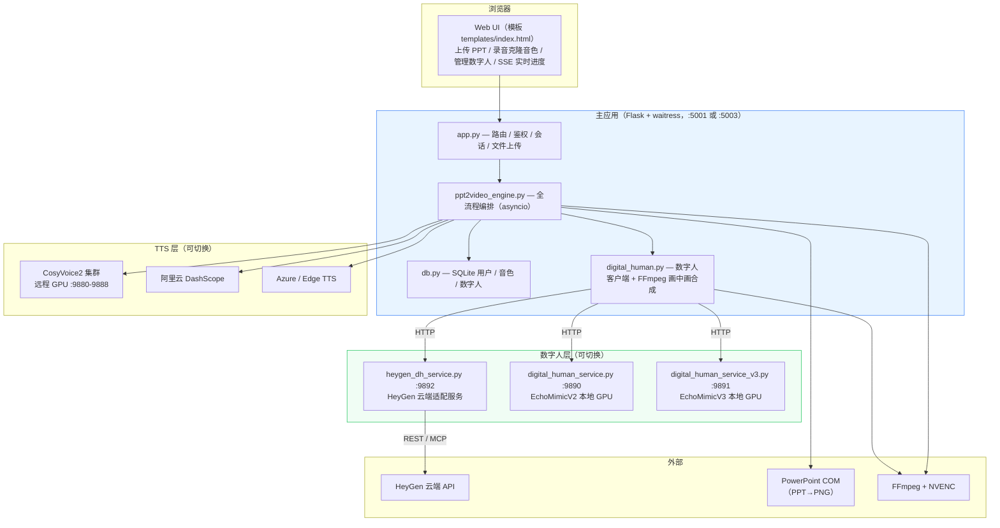
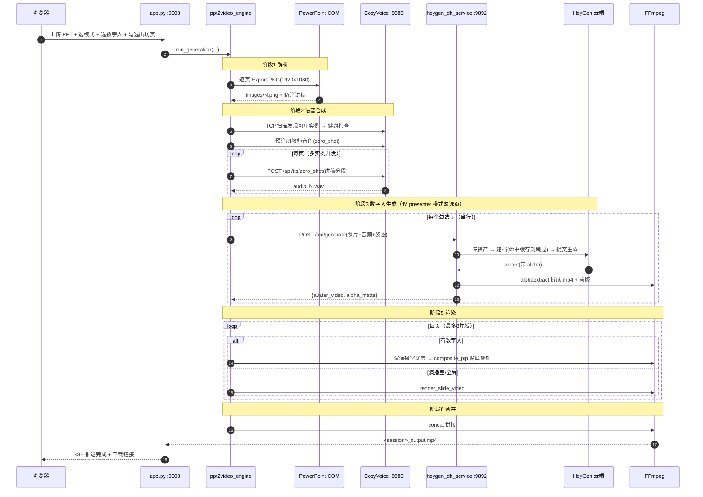
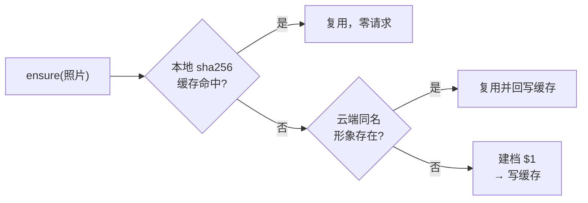
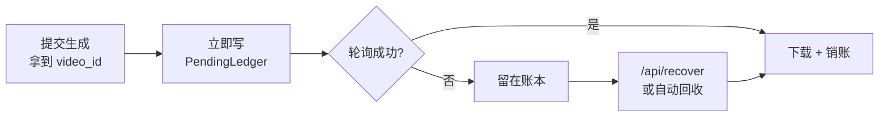
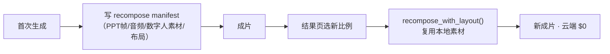
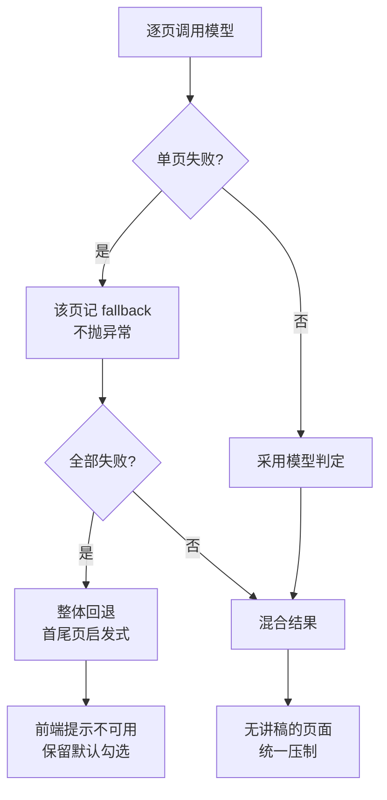

# p2v_CosyVoice 项目说明文档

> **一句话**：把带讲稿备注的 PPT，自动合成为「教师本人声音 + 数字人出镜」的讲解微课视频。
>
> **文档版本**：v1.0 ｜ **更新日期**：2026-09-04
> **适用对象**：需要复现、部署或二次开发本系统的工程师

---

## 目录

1. [系统能做什么](#一系统能做什么)
2. [整体技术架构](#二整体技术架构)
3. [端口与服务清单](#三端口与服务清单)
4. [核心处理流程](#四核心处理流程)
5. [数字人子系统（HeyGen 云端）](#五数字人子系统heygen-云端)
   - [数字人画面布局](#五之二数字人画面布局)
   - [智能推荐出场页面](#五之四智能推荐出场页面)
   - [数字人时长阈值](#五之三数字人时长阈值)
6. [环境准备与部署](#六环境准备与部署)
7. [配置文件详解](#七配置文件详解)
8. [启动与运行](#八启动与运行)
9. [用户使用说明](#九用户使用说明)
10. [数据库结构](#十数据库结构)
11. [成本说明](#十一成本说明)
12. [故障排查](#十二故障排查)
13. [已知限制与注意事项](#十三已知限制与注意事项)
14. [目录结构](#十四目录结构)

---

## 一、系统能做什么

输入一个 `.pptx` 文件（每页在**备注栏**写好讲稿），系统自动完成：

| 环节 | 说明 |
| :--- | :--- |
| **PPT 解析** | 逐页导出 1920×1080 PNG + 提取备注栏讲稿文本 |
| **语音合成** | 用教师本人声音（零样本克隆，5–10 秒录音即可）朗读讲稿 |
| **数字人生成** | 用教师照片生成口型同步的数字人视频（可选） |
| **视频渲染** | 三种画面模式：全屏 / 演播室 / 演播室+数字人 |
| **合并输出** | 拼接为一个完整的 MP4 微课 |

**三种视频模式**

| 模式 | 画面 | 适用 |
| :--- | :--- | :--- |
| `default` 标准全屏 | PPT 铺满画面 + 转场特效 | 纯内容讲解 |
| `studio` 演播室 | 科技感背景 + PPT 嵌入屏幕框 | 提升观感 |
| `presenter` 数字人讲解 | 演播室 + **右侧贴底数字人** | 拟真授课 |

> `presenter` 模式支持**按页选择**：只在你勾选的页面叠加数字人，其余页面自动用演播室模式渲染。

**数字人可调项**（`presenter` 模式）

| 可调项 | 选项 | 默认 | 何时决定 |
| :--- | :--- | :--- | :--- |
| 模型 | Avatar III `$0.02/秒` / Avatar IV `$0.04/秒` | III | 生成前 |
| 姿态 | 展示 / 讲解 / 欢迎 / 自然 / 强调 / 静止 | 展示 | 生成前（仅 IV 生效） |
| 动作表现力 | 高 / 中 / 低 | 高 | 生成前（仅 IV 生效） |
| 高度占比 | 2/3 · 1/2 · 1/3 | 2/3 | 生成前**或生成后**（重合成免费） |
| 出场页面 | 逐页勾选 | — | 生成前 |

**四条省钱机制**（数字人是唯一按秒外付费的环节）

| 机制 | 作用 |
| :--- | :--- |
| 三层防重复建档 | 同一张照片只建一次档（每次 $1） |
| 孤儿任务追回 | 已扣费但没取回的云端成片自动找回 |
| 时长阈值拦截 | 生成前拦截，`数字人时长 ≤ max(5 分钟, 全片 × 10%)` |
| 事后重合成 | 换高度占比复用本地素材，**云端零成本** |

---

## 二、整体技术架构

### 2.1 分层结构



### 2.2 关键设计：数字人引擎可插拔

三个数字人服务对上游暴露**字段级同构**的 HTTP 契约，切换引擎只需改一个配置项，主应用代码零改动：

```
digital_human.py::_service_url()
    ECHOMIMIC_ENGINE = "v2"      → :9890  EchoMimicV2（本地 GPU）
    ECHOMIMIC_ENGINE = "v3"      → :9891  EchoMimicV3（本地 GPU）
    ECHOMIMIC_ENGINE = "heygen"  → :9892  HeyGen 云端（当前生产配置）
```

统一契约：

```
GET  /api/health       服务状态
POST /api/preprocess   照片预处理（HeyGen 下会同时完成云端建档）
POST /api/generate     照片 + 音频 → 数字人视频 + alpha 蒙版
GET  /api/poses        姿态列表
POST /api/unload       卸载模型（云端服务为空操作）
```

**返回值必须包含**：`avatar_video`（彩色轨本地路径）+ `alpha_matte`（灰度蒙版本地路径），供 `composite_pip()` 做 alphamerge 合成。

9892 在共同契约之外另有云端专属端点（不参与引擎切换）：

```
POST /api/generate_async        异步提交，返回 task_id
GET  /api/task/<task_id>        查询异步任务
POST /api/recover               追回已扣费未取回的成片
POST /api/voice/clone           声音克隆（默认关闭）
POST /api/generate_from_script  文本直出（不经 CosyVoice）
GET  /files/<task_id>/<name>    产物下载
```

> **路径解析的坑**：不能优先读 `avatar_video_url`。HeyGen 返回的是 `/files/...` **相对路径**，
> 既不是 http 也不是本地文件，下游会报"文件不存在"。正确顺序是
> **先本地路径 → 再判断 http → 否则拼服务地址下载**。

### 2.3 技术栈

| 层 | 技术 |
| :--- | :--- |
| Web | Flask + waitress（生产级 WSGI）+ Tailwind CSS（CDN） |
| 异步编排 | asyncio + aiohttp（TTS 多实例并发） |
| 数据库 | SQLite（`data/p2v.db`） |
| PPT 解析 | `win32com`（PowerPoint COM 自动化，**Windows 限定**） |
| 视频处理 | FFmpeg（`h264_nvenc` 硬件编码，回落 `libx264`） |
| TTS | CosyVoice2-0.5B（自建）/ DashScope / Azure / Edge |
| 数字人 | HeyGen Avatar III/IV/V（云端）或 EchoMimicV2/V3（本地） |
| 进度推送 | SSE（Server-Sent Events） |

---

## 三、端口与服务清单

| 端口 | 服务 | 进程 | 必需性 |
| :--- | :--- | :--- | :--- |
| **5001** | 主应用（无数字人） | `run.py --port 5001` | 二选一 |
| **5003** | 主应用（**启用数字人**） | `run.py --port 5003 --digital-human` | 二选一 |
| **9880–9888** | CosyVoice2 TTS 集群 | 远程 GPU 机，独立部署 | TTS 用 cosyvoice 时必需 |
| **9890** | EchoMimicV2 数字人 | `digital_human_service.py` | 可选（本地 GPU 方案） |
| **9891** | EchoMimicV3 数字人 | `digital_human_service_v3.py` | 可选（本地 GPU 方案） |
| **9892** | HeyGen 云端适配服务 | `heygen_dh_service.py` | **当前生产方案** |
| 9893 | 预留 | — | — |
| 6274 | HeyGen MCP OAuth 回调 | 一次性授权时临时占用 | 仅 MCP 模式 |
| **8000** | 多模态模型（版式识别） | 内网 `vllm-gemma4-moe.service` | 可选，挂了自动回退启发式 |

> **最小可运行组合**：5003（主应用）+ 9892（数字人）+ 至少一个 CosyVoice 实例。
> 9890/9891 是历史方案，不启动不影响 HeyGen 路线。

---

## 四、核心处理流程



### 4.1 六个阶段与进度权重

| 阶段 | 标识 | presenter 模式权重 |
| :--- | :--- | :--- |
| 解析 PPT | `parse` | 5% |
| 语音合成 | `tts` | 25% |
| 数字人生成 | `dh_generate` | 30% |
| 视频抠图 | `matting` | 10% |
| 视频渲染 | `render` | 20% |
| 合并输出 | `merge` | 10% |

### 4.2 演播室 + 数字人的合成细节

```
① render_slide_video(video_mode="studio")
   背景图 bg_tech.png(1280×800) + PPT 缩放至 990×558 叠加到 (38,66) 屏幕框
   ↓ studio 底层视频

② composite_pip(base_video=studio底层)
   数字人视频 ─┐
   alpha蒙版  ─┴→ alphamerge → 阴影层 → overlay 到右侧贴底 → h264_nvenc
   ↓ 单页成片
```

**数字人贴底的关键**（`digital_human.py::composite_pip`）：

数字人源视频是 9:16 竖版，按比例缩进 480×1080 框后实际约 480×853，剩余高度由 `pad` 补透明像素。若用 `(oh-ih)/2` 垂直居中，人物下方会多出上百像素透明边——视觉上就是"脚不沾地"。因此：

| 参数 | 值 | 作用 |
| :--- | :--- | :--- |
| pad 垂直偏移 | `(oh-ih)` | 内容沉到框底 |
| `overlay_y` | `H-h-padding_y` | 框贴画面底边 |
| `vertical_align` | `"bottom"` | 配置开关（`"center"` 回退旧行为） |

> ⚠️ 蒙版必须与彩色轨用**完全相同**的对齐方式，否则抠像错位。

---

## 五、数字人子系统（HeyGen 云端）

### 5.1 Provider 三选一

`heygen_dh_service.py` 内部通过 `HEYGEN_CONFIG["provider"]` 切换：

| Provider | 认证 | 计费 | 能否建档 | 用途 |
| :--- | :--- | :--- | :--- | :--- |
| `mock` | 无 | **0** | ✅（本地伪造） | 开发联调 / CI 回归，不联网 |
| `rest` | API Key | **API 钱包 USD** | ✅ | **当前生产方案** |
| `mcp` | OAuth 2.1+PKCE | 网页版包月 credits | ❌ 免费版被 403 | 备选 |

> **实测结论（2026-08-19）**：HeyGen **网页版免费账号**调用 `create_photo_avatar` 会被套餐网关直接拒绝
> （`403 forbidden: Avatar creation requires a paid plan`），**与钱包余额无关**，MCP/REST 皆然。
> 必须开通 API 服务（钱包计费）才能通过接口建档。

### 5.2 内部组件

```
heygen/
├── provider_base.py     Provider 抽象接口 + HeyGenError（status/code 语义化）
├── provider_rest.py     v3 REST + API Key   ← 生产
├── provider_mcp.py      MCP JSON-RPC + OAuth
├── provider_mock.py     本地 FFmpeg 伪造产物（零成本）
├── oauth_mcp.py         OAuth PKCE 客户端 + token 自动刷新
├── avatar_registry.py   照片指纹 → avatar_id 缓存（防重复建档）
├── voice_registry.py    音频指纹 → voice_id 缓存
├── credit_guard.py      余额护栏 / 免费版配额账本
├── media_adapter.py     webm(alpha)→mp4+蒙版、绿幕抠像、蒙版自检
├── task_manager.py      线程池 + 并发闸门 + 任务状态机
└── pose_map.py          姿态 → motionPrompt 映射
```

### 5.3 防重复建档（三层，每次建档 $1）



1. **本地 sha256 缓存**（`heygen_avatars.json`）：按**照片字节指纹**索引，与文件路径无关
2. **云端同名查重**：缓存失效时按名称查询账号已有形象，命中则复用
3. **命名统一**：`/api/preprocess` 与 `/api/generate` 均用「照片文件名去扩展名」作为形象名

> 命名不统一曾导致同一张照片在 HeyGen 后台建出两个形象（浪费 $1）。两处调用点必须保持一致。

### 5.4 关键 API 端点（实测确认）

```
GET  /v3/users/me                    账号 + 钱包余额
POST /v3/assets                      资产上传（必须 multipart，字段名 file）
POST /v3/avatars                     建档（type=photo）
GET  /v3/avatars?ownership=private   私有形象列表
GET  /v3/avatars/looks/{lookId}      look 详情（含 supported_api_engines）
POST /v3/videos                      提交生成
GET  /v3/videos/{videoId}            查询状态
```

**踩过的坑**：

| 坑 | 现象 | 正解 |
| :--- | :--- | :--- |
| 建档响应结构 | 按 `id`/`avatar_id` 平铺字段取值全落空 → 502，但云端**已扣费** | id 在 `data.avatar_item.id` |
| 资产上传 | PUT 裸字节 → 400 `invalid_parameter` | multipart，字段名 `file` |
| look 路径 | `/v3/avatar-looks/{id}`、`/v3/avatars/{id}/looks` 均 404 | `/v3/avatars/looks/{id}` |
| MCP 响应 | `resp.json()` 抛 `JSONDecodeError` | 是 SSE（`text/event-stream`），需解析 `data:` 行 |
| VP9 alpha | 蒙版全白 → 数字人成不透明方块 | 解码必须显式 `-c:v libvpx-vp9` |
| alpha 判定 | WebM 的 VP9 alpha 时 `pix_fmt` 仍报 `yuv420p` | 兼看容器 `alpha_mode=1` 标记 |

### 5.5 引擎、姿态与表现力

三个参数在前端暴露，统一由 `heygen/pose_map.py` 定义（**唯一事实源**，前端选项、后端校验、价格标注都读它）：

| 参数 | 取值 | 默认 | 生效范围 |
| :--- | :--- | :--- | :--- |
| `engine` | `avatar_iii` / `avatar_iv` | `avatar_iii` | — |
| `pose` | 展示 / 讲解 / 欢迎 / 自然 / 强调 / 静止 | `presenting`（展示） | **仅 Avatar IV** |
| `expressiveness` | `high` / `medium` / `low` | `high` | **仅 Avatar IV** |

```python
ENGINES = {
    "avatar_iii": {"usd_per_sec": 0.0167, "price_display": "$0.02", "motion": False,
                   "note": "不支持姿态动作（选了也不生效）"},
    "avatar_iv":  {"usd_per_sec": 0.0371, "price_display": "$0.04", "motion": True,
                   "note": "姿态选择在此模型下才真正生效"},
    "avatar_v":   {..., "selectable": False},   # 参考视频驱动，前端不展示
}
```

**为什么 Avatar III 的姿态无效**：III 不接受 `motionPrompt`，动作**完全由源照片的肢体姿势决定**。
实测（归一化运动量 = 帧间差 ÷ 前景占比，消除主体大小干扰）：

| 源照片 | 归一化运动量 |
| :--- | :--- |
| 双手张开 / 有手势 | **15 ~ 18** |
| 双手交叠 / 垂放 | 7 ~ 8 |

> 未归一化的初测结果（7.58 vs 3.7）反映的其实是**主体在画面中的大小**，不是动作幅度，据此下结论会误判。

因此前端在上传照片处给出**动作与表情要求**提示（半身、双手可见且张开、露齿微笑等）——
这不是审美建议，而是 Avatar III 下**唯一能影响动作**的杠杆。

**expressiveness 的坑**：Avatar IV 初测运动量反而**低于** III。原因是该参数**默认为 `low`**，
而当时代码根本没有下发这个字段。补发 `high` 后才符合预期。另注意 `avatar_v` 会**直接报错拒绝**
该参数（不是忽略），故 `provider_rest.py` 里按引擎条件下发：

```python
if opts.get("expressiveness") and opts.get("engine") == "avatar_iv":
    payload["expressiveness"] = opts["expressiveness"]
```

### 5.6 孤儿任务追回（已扣费未取回）

**问题**：`POST /v3/videos` 返回 `video_id` 的那一刻**就已扣费**。此后进程崩溃、轮询断连、
网络抖动，钱都已经花掉，但成片拿不到。

**机制**：拿到 `video_id` 立刻写 `PendingLedger`（落盘），后续按需追回。



三个触发点：

1. **合成阶段自动回收** — `ppt2video_engine.py` 发现某些页缺数字人时，先查账本再重试
   ```python
   failed_pages = [p for p in dh_audio_files if (p - 1) not in dh_results]
   if failed_pages:
       recovered = recover_pending(purpose_prefix=dh_purpose_prefix)
   ```
2. **成片自检** — 成片生成后若检出「云端已生成但画面无数字人」，后台自动重新合成再呈现
3. **手动** — `POST /api/recover`（9892）

**轮询容错**：轮询失败**不能立即放弃**（此刻已扣费），需连续 5 次失败才认定断连；
`_request` 用 0.5/1/2/4s 指数退避重试 4 次——实测 `SSL: UNEXPECTED_EOF_WHILE_READING`
一天内出现三次，其中一次正发生在视频已提交、正在轮询的阶段。

> 该机制已实际追回过一笔 $0.32 的孤儿任务。

---

## 五之二、数字人画面布局

### 5b.1 演播室画中画

成片为**演播室背景 + PPT 画面 + 右下角数字人**三层合成。数字人来自 HeyGen 的
alpha 通道 WebM，经 `media_adapter.split_alpha_webm()` 拆成「彩色视频 + 灰度蒙版」两个文件，
再由 `composite_pip()` 用 `alphamerge` 贴合。

### 5b.2 贴底对齐（两个独立成因）

用户反馈「数字人悬浮、没落地」。前后修了**两次，根因不同**：

| 轮次 | 根因 | 修法 |
| :--- | :--- | :--- |
| 第一次 | `pad=(oh-ih)/2` 是**垂直居中** | 改为 `pad=(oh-ih)`，即底对齐 |
| 第二次 | 源视频人物**未铺满画面**（`fit=contain`），底部约 **16% 是透明留白** | `cropdetect` 求人物包围盒后裁掉留白 |

第二次尤其隐蔽：视频"底部"确实贴住了画框，但人物脚下还有一截透明区域，视觉上仍是悬浮。

```python
def detect_person_vertical_bounds(alpha_matte, sample_frames=60):
    """对蒙版跑 cropdetect 求人物真实包围盒"""
```

对应两个布局开关：

```python
DH_PIP_LAYOUT = {
    "vertical_align": "bottom",   # bottom | center
    "trim_transparent": True,     # 裁掉人物下方透明留白
}
```

### 5b.3 高度占比

数字人高度按**画面高度的比例**计算，不写死像素——换分辨率不用改配置：

| 选项 | `height_ratio` | 观感 |
| :--- | :--- | :--- |
| 三分之二 | `0.667`（**默认**） | 主体突出，推荐 |
| 二分之一 | `0.5` | 均衡 |
| 三分之一 | `0.333` | PPT 为主 |

指定 `height_ratio` 时走**精确右对齐 + 贴底**路径（不做 pad）：

```python
if target_h:
    scale_expr = f"{crop_filter}scale=-2:{target_h}"
```

### 5b.4 事后重合成（零云端成本）

已生成的视频可在结果页**直接换比例重新合成**，不重新调用 HeyGen——布局是纯本地 FFmpeg 操作。



| 组件 | 位置 |
| :--- | :--- |
| 清单落盘 | `ppt2video_engine._save_recompose_manifest()` |
| 重合成 | `ppt2video_engine.recompose_with_layout(session_id, pip_layout)` |
| 素材目录 | `static/outputs/recompose/` |
| 可用性查询 | `GET /api/recompose/available/<session_id>` |
| 触发 | `POST /api/recompose` |

前端拿到新地址后**原地替换 video 源**，不跳页。

---

## 五之四、智能推荐出场页面

### 5d.1 解决什么问题

数字人不该每页都上。真正需要"人出镜"的是**信息密度低、靠讲述串场**的页面
（标题页、章节过渡页、总结页、结尾页）；正文页信息都在 PPT 上，人出镜既抢画面又按秒计费。

原先前端用 `第一页 or 最后一页` 的**位置启发式**默认勾选，遇到
「封面 + 目录 + 3 个章节分隔页 + 结尾」这类结构就会漏掉中间的过渡页。

现改为把**缩略图 + 讲稿**一起交给本地部署的多模态模型判版式。

### 5d.2 模型服务

| 项 | 值 |
| :--- | :--- |
| 服务 | `vllm-gemma4-moe.service` |
| 地址 | `http://10.255.1.118:8000/v1`（OpenAI 兼容） |
| 模型 | `gemma-4-moe`（26B MoE，多模态，32K 上下文） |
| 成本 | **纯内网自建，零 API 费用** |

### 5d.3 五种版式

`slide_classifier.py::PAGE_TYPES` 是唯一事实源：

| 类型 | 标签 | 数字人出场 |
| :--- | :--- | :--- |
| `title` | 标题页 | ✅ |
| `section` | 过渡页（章节分隔 / 目录 / 导入） | ✅ |
| `summary` | 总结页 | ✅ |
| `closing` | 结尾页 | ✅ |
| `content` | 内容页（正文 / 图表 / 代码 / 截图） | ❌ |

### 5d.4 关键判据：信息密度，不是页码位置

提示词里有一条**必须保留**的规则：

> 画面主体是软件截图、产品界面、操作演示、照片或示意图的，**一律是 content**，
> 哪怕文字很少、留白很多。

**踩坑记录**：最初只写"画面越空越可能是标题页"，结果一份演示类课件里，
登录界面截图、课程列表截图等 6 页全被误判成 title/section——它们文字确实少，
但要让学员看清画面，绝不该让数字人挡在前面。补上这条规则后误判清零。

### 5d.5 兜底策略（三层）

智能推荐只是锦上添花，**任何一环失败都不能阻断生成流程**：



1. **单页失败**收敛为 `source: "fallback"`，不影响其他页
2. **整体失败**（服务宕机）回退原有的首尾页启发式，前端提示「智能推荐不可用」
3. **无讲稿的页面一律不推荐** —— 没有讲稿就合成不出语音，数字人无从口型同步。
   这层压制放在最后统一执行，模型判成什么类型都不例外

### 5d.6 性能

19 页课件、4 路并发：**约 6 秒**。缩略图送模型前会缩到长边 768 并转 JPEG，
请求体比原始 PNG 小一个数量级。

前端**不等待**分类结果：先把页面列表渲染出来交给用户，模型判定回来再就地更新勾选，
避免解析完还要空等。

### 5d.7 接口

```
POST /api/ppt/classify   {"session_id": "<preview 返回的 8 位 id>"}
→ {"success": true, "available": true, "elapsed": 6.1,
   "recommended_pages": [1, 17, 19],
   "slides": [{"page":1, "type":"title", "label":"标题页",
               "dh_recommended":true, "reason":"画面留白多，仅有标题",
               "source":"model"}, ...]}
```

> **只收 `session_id`，不接受前端传路径**。缩略图与讲稿都由服务端从
> `temp_<sid>/` 重新读取，且 `session_id` 必须匹配 `[0-9a-f]{1,32}`
> —— 否则前端可构造 `../` 读到任意文件。

---

## 五之三、数字人时长阈值

数字人是唯一按秒外付费的环节，因此在**选页阶段**（生成前）就拦截。

**规则**：`数字人时长 ≤ max(5 分钟, 全片时长 × 10%)`

```
DH_DURATION_LIMIT_MIN_DH  = 300    # 秒；低于此值不限制
DH_DURATION_RATIO_LIMIT   = 0.10   # 超过阈值后按全片比例限制
```

两个参数都可用同名环境变量覆盖。

- **门槛看的是数字人时长，不是全片时长** —— 5 分钟数字人约合 Avatar III $5.0 / IV $11.1，
  以此作为开始介入成本控制的起点
- **拐点在全片 50 分钟**：全片短于 50 分钟时，实际上限恒为 5 分钟；长于 50 分钟才由 10% 接管

时长由讲稿字数估算（`estimate_speech_seconds`，约 4.5 字/秒），`/api/ppt/preview` 一并返回
`est_seconds` / `total_est_seconds` / `dh_limit_seconds` 等字段供前端实时提示。

> **前端禁用按钮只是提示，可绕过**。`/api/ppt/generate` 服务端会**独立复核**，
> 超限返回 `400 {"code": "dh_duration_exceeded"}`。前端兜底默认值必须与后端保持一致
> （`index.html` 里的 `d.dh_limit_min_dh || 300`），否则前后端判断会分叉。

---

## 六、环境准备与部署

### 6.1 硬性前提

| 项 | 要求 | 原因 |
| :--- | :--- | :--- |
| **操作系统** | **Windows** | PPT 转图片依赖 PowerPoint COM 自动化 |
| **Microsoft PowerPoint** | 已安装并可正常启动 | 同上 |
| **Python** | 3.10+（实测 3.14） | 使用了 `X \| None` 等新语法 |
| **FFmpeg** | 在 PATH 中，需支持 `libvpx-vp9` | 视频合成 + alpha 拆分 |
| **NVIDIA GPU**（可选） | 支持 `h264_nvenc` | 加速编码，无则自动回落 `libx264` |

验证 FFmpeg：

```powershell
ffmpeg -decoders | findstr vp9      # 必须有 libvpx-vp9
ffmpeg -encoders | findstr nvenc    # 有则用硬编，无则 libx264
```

### 6.2 安装依赖

```powershell
conda create -n p2v python=3.12
conda activate p2v
pip install -r requirements.txt
```

`requirements.txt`：

```
flask, waitress, requests, httpx, edge-tts,
python-pptx, pywin32, azure-cognitiveservices-speech,
Pillow, opencv-python
```

> `opencv-python` 对 9892 服务是**可选**的——缺失时仅跳过人脸检测，不影响主链路。

### 6.3 CosyVoice TTS 集群（独立部署）

TTS 服务需在**另一台 GPU 机**上部署，暴露 `POST /api/tts/zero_shot`，端口段 9880–9888。
参见 `COSYVOICE_START_GUIDE.md`。主应用通过 TCP 端口扫描 + 健康检查自动发现可用实例。

> 若不自建 CosyVoice，可改用 `--provider dashscope`（阿里云百炼）或 `azure` / `edge`。

### 6.4 HeyGen 账号准备

1. 注册 HeyGen 并**开通 API 服务**（必须，免费网页版无法通过接口建档）
2. 在 HeyGen 控制台获取 API Key（形如 `sk_V2_...`）
3. 确保 API 钱包有余额

---

## 七、配置文件详解

复制模板后填写：

```powershell
copy config_local.example.py config_local.py
```

> `config_local.py` 已在 `.gitignore` 中，**不会被提交**。所有密钥只放这里。

### 7.1 基础配置

```python
FLASK_SECRET_KEY = "替换为随机字符串"

# CosyVoice 集群（主应用自动扫描此范围内的活跃实例）
COSYVOICE_SERVERS = [
    {"host": "10.x.x.x", "port_range": (9880, 9888)},
]

# 阿里云百炼（provider=dashscope 时用）
DASHSCOPE_API_KEY = "sk-..."
DASHSCOPE_MODEL = "cosyvoice-v3.5-plus"
```

### 7.2 数字人引擎选择

```python
ECHOMIMIC_ENGINE = "heygen"   # "v2" | "v3" | "heygen"

ECHOMIMIC_SERVER    = {"host": "127.0.0.1", "port": 9890}
ECHOMIMIC_V3_SERVER = {"host": "127.0.0.1", "port": 9891}
HEYGEN_SERVER       = {"host": "127.0.0.1", "port": 9892}
```

### 7.3 HeyGen 服务配置

```python
HEYGEN_CONFIG = {
    "plan_tier": "wallet",        # wallet(API钱包) | free(网页免费版) | creator/pro
    "provider": "rest",           # rest | mcp | mock

    "api_key": "sk_V2_...",       # REST 模式必填
    "rest_endpoint": "https://api.heygen.com",

    "preset_avatar_id": "",       # 固定复用某形象时填；留空=每张照片各自建档
    "allow_avatar_creation": True,# 允许云端建档（会扣费）

    "preset_voice_id": "",
    "allow_voice_cloning": False,

    "default_engine": "avatar_iii",  # avatar_iii(性价比最高) | avatar_iv | avatar_v
    "resolution": "720p",
    "aspect_ratio": "9:16",
    "output_format": "webm",         # webm 才有 alpha 通道
    "matte_mode": "split",           # split | chromakey | passthrough

    "max_concurrent": 1,
    "timeout": 900,

    "credit_warn_threshold": 50,     # 余额低于此值告警
    "credit_hard_stop": 5,           # 余额低于此值熔断

    "avatar_registry_path": "heygen_avatars.json",
    "pending_ledger_path": "heygen_pending.json",   # 已扣费未取回任务账本
    "work_dir": "heygen_work",
}
```

> `default_engine` 只是**前端未选时的兜底**。用户在页面上选了模型/姿态/表现力，
> 会随请求逐次下发并覆盖此处默认值。
>
> 想彻底杜绝意外的 $1 建档：置 `allow_avatar_creation: False` 并配好 `preset_avatar_id`。

### 7.4 画中画布局

```python
DH_PIP_LAYOUT = {
    "avatar_width": 480,
    "avatar_height": 1080,
    "height_ratio": 0.667,        # 按画面高度的比例（优先级高于 avatar_height）
    "position": "right_bottom",
    "padding_x": 20,
    "vertical_align": "bottom",   # bottom=贴底(推荐) | center=垂直居中
    "padding_y": 0,               # 贴底时距底边留白
    "trim_transparent": True,     # 裁掉人物下方约 16% 的透明留白，否则贴底后仍显悬浮
    "shadow": True,
    "shadow_opacity": 0.15,
    "shadow_blur": 6,
    "shadow_offset": 3,
}
```

| 键 | 作用 | 详见 |
| :--- | :--- | :--- |
| `height_ratio` | 数字人高度占画面高度的比例，**前端可选**（2/3、1/2、1/3） | [5b.3](#5b3-高度占比) |
| `vertical_align` | 贴底 or 居中 | [5b.2](#5b2-贴底对齐两个独立成因) |
| `trim_transparent` | 裁掉源视频人物脚下的透明留白 | [5b.2](#5b2-贴底对齐两个独立成因) |

> **`height_ratio` 与 `avatar_height` 的关系**：设了 `height_ratio` 就以它为准，
> `avatar_height` 被忽略。比例路径不做 pad，直接精确右对齐 + 贴底。
>
> 仅在**未设** `height_ratio` 时才用 `avatar_height`。此时注意：演播室成片为 **1280×800**，
> 而 `avatar_height=1080` 大于画面高度，数字人顶部会被裁掉一截（呈现为半身入镜）。

### 7.5 数字人时长阈值（环境变量）

时长阈值不在 `config_local.py`，走**环境变量**，便于按部署环境调整：

```powershell
$env:DH_DURATION_LIMIT_MIN_DH = "300"    # 秒，默认 300
$env:DH_DURATION_RATIO_LIMIT  = "0.10"   # 默认 0.10
```

> 改 `DH_DURATION_LIMIT_MIN_DH` 时，`templates/index.html` 里的前端兜底值
> （`d.dh_limit_min_dh || 300`）需**同步修改**，否则接口异常时前后端判断会分叉。

---

## 八、启动与运行

### 8.1 一键重启（推荐）

```powershell
.\restart_services.ps1                    # 重启 9892 + 5003
.\restart_services.ps1 -Only dh           # 只重启数字人服务
.\restart_services.ps1 -Only app          # 只重启主应用
.\restart_services.ps1 -NoDigitalHuman    # 主应用不带数字人
```

脚本做四件事：**按端口找到真实 Windows PID 并强杀 → 以 UTF-8 / 无缓冲启动 →
健康检查 → 回显当前生效配置**。最后一步是关键：它把引擎、Provider、默认模型、
布局参数打印出来，**用来证明新代码确实加载了**。

> [!IMPORTANT]
> **改完代码必须重启服务**。Python 在进程启动时加载模块，源文件改动对已跑的进程无效。
> 本项目曾两次因此误判「修复没生效」——实际是进程比修复更早启动。
> 只要看到「改了代码但行为没变」，第一件事是核对进程启动时间与文件修改时间。

**手工启动**（等价）：

```powershell
# ① 数字人服务（HeyGen 方案）
python heygen_dh_service.py --port 9892

# ② 主应用（启用数字人）
python run.py --port 5003 --digital-human

# 若不需要数字人，只启主应用即可
python run.py --port 5001
```

访问 **http://127.0.0.1:5003**

> **Windows 停服注意**：Git Bash 里的 `kill $!` 杀不掉真实 Windows 进程，会留下僵死实例
> 占着端口，表现为「重启了但还是旧行为」。必须用：
> ```powershell
> Get-NetTCPConnection -LocalPort 5003 -State Listen |
>   ForEach-Object { Stop-Process -Id $_.OwningProcess -Force }
> ```

### 8.2 启动前自检

```powershell
# 数字人服务健康检查（应返回 status=ok, cloud_reachable=true）
curl http://127.0.0.1:9892/api/health

# CosyVoice 实例连通性
Test-NetConnection 10.x.x.x -Port 9880
```

`/api/health` 关键字段：

```json
{
  "status": "ok",
  "provider": "rest",
  "cloud_reachable": true,
  "credits_remaining": 98.0,
  "credits_unit": "usd",
  "cached_avatars": 1,
  "engine": "avatar_iii"
}
```

### 8.3 零成本联调模式

开发调试时把 `provider` 改成 `"mock"`，本地用 FFmpeg 伪造数字人产物，**完全不联网、不花钱**，
可验证除「真实抠像质量、口型同步、云端参数校验」外的全部链路：

```powershell
# 独立自测（不需要起服务）
python -m heygen.provider_mock test/photo.png test/audio.wav out_dir
python -m heygen.media_adapter verify alpha_matte.mp4
```

---

## 九、用户使用说明

### 步骤 1：注册登录

首次访问 `/login` 页面注册账号。系统按账号隔离音色与数字人数据。

### 步骤 2：创建音色（声音克隆）

1. 点击「创建音色」
2. 录制或上传 **5–10 秒**清晰人声
3. 填写**与录音内容完全一致**的文本（提示词，影响克隆效果）
4. 提交后系统自动注册到 CosyVoice 集群

> 音色注册是**预注册**机制：生成任务开始时会自动同步到所有可用实例。

### 步骤 3：创建数字人形象（可选）

1. 在「选择数字人形象」区点击「+ 创建新数字人」
2. 上传照片，要求：

   **画质要求**
   - **竖版半身正面照**，背景干净、光线均匀
   - 分辨率 **512×512 以上**（推荐 768×1024+）
   - JPG/PNG，**≤10MB**

   **动作与表情要求**（直接决定成片动作幅度，见下方说明）
   - 取景**半身**，**双手可见且自然张开**——手交叠或垂放会明显减少动作
   - 表情自然，**可以露齿微笑**，避免面无表情
   - 身体略微侧向、姿态放松，避免僵直站立

3. 填写名称并提交

> 💰 **每张新照片首次创建形象需 $1**（HeyGen 云端建档）。同一张照片只会创建一次，之后生成视频均直接复用该形象。

> **为什么照片姿势这么重要**：Avatar III 不接受动作指令，成片动作**完全由源照片的肢体姿势决定**。
> 实测双手张开的照片，动作幅度约为双手交叠照片的 **2 倍**。想要更明确的动作控制，
> 需在生成时改用 Avatar IV（支持姿态与表现力参数，价格约 2.2×）。

### 步骤 4：准备 PPT

在 PowerPoint 中为每页填写**备注栏**讲稿——系统读取的是备注，不是幻灯片正文。

### 步骤 5：生成视频

1. 上传 `.pptx`
2. 选择音色
3. 选择视频模式：
   - 标准全屏 / 演播室 / **数字人讲解**
4. 若选数字人讲解，依次设置：

   | 选项 | 默认 | 说明 |
   | :--- | :--- | :--- |
   | 数字人形象 | — | 已创建的形象，复用不再收费 |
   | **模型** | Avatar III | III $0.02/秒；IV $0.04/秒，支持姿态与表情 |
   | **姿态** | 展示姿态 | 6 选 1，**仅 Avatar IV 生效**（选 III 时该面板隐藏） |
   | **动作表现力** | 高 | 高 / 中 / 低，**仅 Avatar IV 生效** |
   | **高度占比** | 三分之二 | 数字人在画面中的高度，可事后修改 |
   | **出场页面** | **智能推荐** | 上传 PPT 后自动分析版式并勾选，可手动增删 |

   **出场页面会自动勾选**：上传 PPT 后系统用本地多模态模型分析每页版式，
   自动勾选标题页、过渡页、总结页、结尾页，正文页默认不勾。页码旁会显示
   版式标签（鼠标悬停看判断理由）。不满意可点「智能推荐」重跑，或直接手动勾选。

5. 勾选页面时，右侧实时显示**预估数字人时长**。超过阈值会弹窗提示并禁用生成按钮
   —— 规则是 `数字人时长 ≤ max(5 分钟, 全片 × 10%)`，减少勾选页数即可继续
6. 点击生成，通过实时进度条查看六阶段进展
7. 完成后在线预览或下载

### 步骤 6：调整数字人高度（生成后，免费）

结果页提供**比例调整面板**，可把已生成的视频换成三分之二 / 二分之一 / 三分之一重新合成。

- 复用本地已有素材，**不重新调用 HeyGen，云端零成本**
- 合成完成后**原地替换播放器视频源**，不跳页
- 可反复切换比较

### 步骤 7：结果位置

| 产物 | 路径 |
| :--- | :--- |
| 最终视频 | `static/outputs/<session>_output.mp4` |
| 重合成素材与清单 | `static/outputs/recompose/<session>/` |
| 数字人中间产物 | `heygen_work/generated/<task_id>/` |
| 上传的照片 | `static/uploads/` |

---

## 十、数据库结构

SQLite，位于 `data/p2v.db`，`init_db()` 幂等建表。

```sql
users            (id, username, password_hash, display_name, created_at)

user_voices      (id, user_id, voice_name, cosyvoice_speaker_id,
                  prompt_text, dashscope_voice_id, created_at)

digital_humans   (id, user_id, name, original_photo_path, processed_photo_path,
                  thumbnail_path, pose_variants, is_default, metadata, created_at)
```

**`digital_humans.metadata`**（JSON）承载云端引擎关联信息，无需改表结构即可扩展：

```json
{ "heygen_avatar_id": "c5a18296...", "heygen_avatar_source": "created" }
```

读写用这对函数（`metadata` 列原本就存在但未使用，因此**无需迁移**）：

```python
db.update_digital_human_metadata(dh_id, user_id, heygen_avatar_id="c5a...",
                                 heygen_avatar_source="created")   # 按字段合并写入
db.get_digital_human_metadata(dh_id, user_id)                      # 返回 dict
```

两个函数都要求传 `user_id`——**归属校验**，防止跨账号读写他人形象。

> 查询某用户的全部形象用 `db.get_user_digital_humans(user_id)`。
> 不存在 `get_digital_humans()` —— 曾在一处兜底分支里误用该名，属潜伏的 `AttributeError`。

> 表结构升级采用 `ALTER TABLE` + `try/except sqlite3.OperationalError: pass` 的幂等模式（见 `db.py::init_db`）。

---

## 十一、成本说明

### HeyGen（API 钱包，USD 计费）

单价来自**钱包余额实测**（2026-09-05），不是文档推算：

| 项目 | 单价 | 说明 |
| :--- | :--- | :--- |
| 照片数字人**建档** | **$1.00 / 次** | 每张新照片一次，之后复用 |
| 生成 **Avatar III** | **$0.0167 / 秒** | 性价比最高，**默认** |
| 生成 Avatar IV | **$0.0371 / 秒** | 支持姿态动作与表情，约 **2.23×** 价格 |
| 生成 Avatar V | $0.0371 / 秒（估） | 未实测，前端未开放 |
| 声音克隆 | 见官方定价 | 本系统默认关闭 |

**实测样本**：

| 引擎 | 样本 | 总扣费 / 总秒数 | 单价 |
| :--- | :--- | :--- | :--- |
| Avatar III | 5.0s + 14.8s = 19.8s | $0.33 | $0.0167/秒 |
| Avatar IV | 14.9s + 5.3s = 20.2s | $0.75 | $0.0371/秒 |

同引擎两样本单价高度一致（III: 0.0160/0.0169，IV: 0.0369/0.0377），说明**按秒线性计费、无最低消费**。

> [!WARNING]
> 早期调研文档给出的 $0.0216 / $0.05 **均偏高**（分别高估 30% / 35%），已废弃。
> 若发现实际扣费与本表不符，请以 HeyGen 后台账单为准，同步修改
> `heygen/pose_map.py::ENGINES` 与 `heygen/credit_guard.py::USD_RATE_PER_SEC`
> **两处**——前者供前端标价，后者供扣费预估与余额熔断，不一致会导致
> "按 A 标价、按 B 拦截"。

**估算**：一节 5 分钟微课，其中 4 分钟含数字人（Avatar III）≈ **$4.01**（不含首次建档）。

> `CreditGuard` 在生成前按余额币种（USD/credits）预估消耗，余额低于 `credit_hard_stop` 直接熔断（402）。

### 前端展示价 vs 后端计费价

前端卡片显示的是**向上取整到分**的友好数字，后端仍用实测精确值计算：

| 引擎 | 前端展示 | 后端计费预估 |
| :--- | :--- | :--- |
| Avatar III | $0.02/秒 | $0.0167/秒 |
| Avatar IV | $0.04/秒 | $0.0371/秒 |

刻意分离的原因：`usd_per_sec` 同时用于**余额熔断判断**，取整会让预估偏高约 20%，可能在余额其实够用时提前拦截；而展示值向上取整可保证用户看到的永远不低于实际。

### 其他

- **CosyVoice**：自建，仅电费 + 硬件折旧
- **DashScope**：按阿里云计费
- **EchoMimicV2/V3**：本地 GPU，零 API 成本但占用 40GB+ 显存

---

## 十二、故障排查

| 现象 | 原因 | 处理 |
| :--- | :--- | :--- |
| `未发现任何可用实例!` TTS 卡住 | CosyVoice 未启动 | 到 GPU 机启动服务；`Test-NetConnection <ip> -Port 9880` 验证 |
| 数字人生成 `0/1 页`，成片无数字人 | 9892 报错 | 看 9892 日志 `[HeyGen-DH] ❌` 行 |
| 502 BAD GATEWAY | 云端调用失败 | 查 9892 日志的 `code=` 字段定位 |
| `403 Avatar creation requires a paid plan` | 账号未开通 API 服务 | 开通 API 服务或配置 `preset_avatar_id` |
| 数字人成不透明方块 | VP9 alpha 丢失 | 确认解码带 `-c:v libvpx-vp9`；`python -m heygen.media_adapter verify <matte>` |
| 数字人"悬浮"不贴地 | ① `vertical_align` 为 center | 改为 `"bottom"` |
| 　同上，改了仍悬浮 | ② 源视频人物脚下有约 16% 透明留白 | 置 `trim_transparent: True` |
| 控制台 emoji 报 `UnicodeEncodeError` | Windows GBK 控制台 | 启动前设 `PYTHONIOENCODING=utf-8` |
| 同一照片建了多个形象 | 缓存丢失 + 命名不一致 | 已修；检查 `heygen_avatars.json` 是否存在 |
| **改了代码但行为没变** | 进程比修复更早启动 | `.\restart_services.ps1`；对比进程启动时间与文件修改时间 |
| 云端已生成但成片没有数字人 | 轮询断连 / 下载失败（**钱已扣**） | 一般会自动回收；否则 `POST /api/recover` |
| `400 dh_duration_exceeded` | 数字人时长超阈值 | 减少勾选页数，或调 `DH_DURATION_LIMIT_MIN_DH` |
| Avatar III 选了姿态没效果 | III 不支持 `motionPrompt` | 预期行为；换 Avatar IV，或改用手部张开的源照片 |
| Avatar IV 动作比 III 还小 | `expressiveness` 默认 `low` | 已修（默认下发 `high`）；确认请求含该字段 |
| `.ps1` 报字符串未终止 | 文件存成了无 BOM 的 UTF-8 | PowerShell 5.1 需 **UTF-8 with BOM** 才认中文 |
| 提示「智能推荐不可用」 | 多模态模型服务不可达 | `curl http://10.255.1.118:8000/v1/models`；不影响生成，可手动勾选 |
| 智能推荐把截图页判成过渡页 | 提示词缺"截图=正文"规则 | 见 [5d.4](#5d4-关键判据信息密度不是页码位置)，勿删该条规则 |
| 某页明明是标题页却没勾上 | 该页**没有讲稿** | 预期行为：无讲稿不合成语音，数字人无从驱动 |

### 常用诊断命令

```powershell
# 端口占用与归属进程
Get-NetTCPConnection -LocalPort 9892 -State Listen |
    Select-Object LocalPort, OwningProcess

# 蒙版质量自检（应为"人形白+背景黑"）
python -m heygen.media_adapter verify heygen_work\generated\<task>\alpha_matte.mp4

# 查看已建档缓存
type heygen_avatars.json

# 查看已扣费但未取回的任务（孤儿账本）
type heygen_pending.json

# 手动追回孤儿任务
curl -X POST http://127.0.0.1:9892/api/recover

# 确认进程比修复更新（启动时间 应晚于 文件修改时间）
Get-Process python | Select-Object Id, StartTime
```

> **Windows 进程管理提醒**：Git Bash 的 `kill $!` 拿到的是 Bash 内部 PID，杀不掉真实进程。
> 请用 `Get-NetTCPConnection` 取 `OwningProcess` 再 `Stop-Process -Id <pid> -Force`。

---

## 十三、已知限制与注意事项

### 平台限制

- **仅 Windows**：PPT 转图片依赖 PowerPoint COM，无法在 Linux/macOS 运行
- 转换期间会启动 PowerPoint 进程，请勿同时手工操作 PPT

### 功能限制

| 限制 | 说明 |
| :--- | :--- |
| 数字人**串行**生成 | `max_concurrent=1`；异步接口 `/api/generate_async` 已备好但主流程未接入 |
| 演播室分辨率 1280×800 | 未设 `height_ratio` 时，`avatar_height=1080` 会被裁顶，呈半身 |
| 声音克隆未启用 | 代码已实现（`voice_registry` + `clone_voice`），配置默认关闭 |
| `provider=mcp` 无法建档 | 免费网页版账号被套餐网关拒绝 |
| 水印字段不可靠 | HeyGen 响应不一定含 `watermarked`，判断仅供参考 |
| Avatar V 未开放 | 需参考视频驱动，且拒绝 `expressiveness`，前端 `selectable: False` |
| Avatar III 姿态不可控 | 引擎不接受动作指令，只能靠源照片姿势影响 |
| 时长为**估算**值 | 按 ~4.5 字/秒推算，与实际 TTS 输出有偏差，阈值判断同样是估算 |
| 版式识别依赖内网服务 | `10.255.1.118:8000` 不可达时退回首尾页启发式，不影响生成 |
| 版式判断非 100% 准确 | 模型判定仅作**默认勾选**，用户可随时手动增删 |
| 重合成仅换布局 | 只能改高度占比等本地布局参数；换模型 / 姿态 / 表现力须重新生成（重新计费） |

### 成本相关的注意事项

- **建档 $1、生成按秒**，两者独立。删除本地 `heygen_avatars.json` 会丢失指纹缓存，
  但云端同名查重仍能兜底；两层都失效才会重复扣费
- **提交即扣费**：`POST /v3/videos` 返回 `video_id` 时钱已花掉，后续失败不退。
  因此有 `PendingLedger` + `/api/recover`
- 想彻底杜绝意外建档，置 `allow_avatar_creation: False` 并配好 `preset_avatar_id`
- 调试期一律用 `provider="mock"`

### 安全注意

- `config_local.py` 含 API Key / 密钥，**已 gitignore，切勿提交**
- 以下运行产物也已 gitignore：
  `heygen_work/`、`heygen_avatars.json`、`heygen_quota.json`、`heygen_pending.json`、
  `test/heygen_token.json`
- 用户密码为 SHA256 哈希存储（**无 salt**，生产环境建议升级为 bcrypt/argon2）
- 临时测试脚本容易夹带明文密钥。本项目曾有两个脚本硬编码了真实 DashScope Key
  且未被 gitignore 覆盖——**测试脚本一律从 `config_local.py` 读取密钥**，不要写字面量

---

## 十四、目录结构

```
p2v_CosyVoice/
├── run.py                      启动入口（CLI 参数解析 → waitress）
├── app.py                      Flask 路由 / 鉴权 / 上传 / SSE
├── ppt2video_engine.py         全流程编排（解析→TTS→数字人→渲染→合并）
├── digital_human.py            数字人客户端 + FFmpeg 画中画合成
├── slide_classifier.py         幻灯片版式分类（多模态模型，推荐出场页面）
├── db.py                       SQLite 数据访问
│
├── heygen_dh_service.py        HeyGen 适配服务 (:9892)
├── heygen/                     HeyGen 子系统包（见 §5.2）
│
├── digital_human_service.py    EchoMimicV2 服务 (:9890) — 可选
├── digital_human_service_v3.py EchoMimicV3 服务 (:9891) — 可选
│
├── config_local.example.py     配置模板
├── config_local.py             实际配置（gitignore）
├── restart_services.ps1        一键重启（UTF-8 with BOM）
├── requirements.txt
│
├── templates/
│   ├── index.html              前端单页（模型/姿态/表现力/占比/时长阈值）
│   └── preview.html            结果页（比例调整 + 事后重合成）
├── static/
│   ├── assets/bg_tech.png      演播室背景
│   ├── uploads/                用户上传
│   └── outputs/
│       ├── <session>_output.mp4    成片
│       └── recompose/              重合成素材与清单
├── data/p2v.db                 SQLite
├── heygen_work/                数字人中间产物（gitignore）
├── heygen_avatars.json         照片指纹 → avatar_id 缓存（gitignore）
├── heygen_pending.json         已扣费未取回任务账本（gitignore）
│
└── 文档/
    ├── 项目说明文档.md          ← 本文
    ├── README.md               开源项目介绍
    ├── HeyGen数字人服务_9892_技术方案.md   数字人子系统详设
    ├── COSYVOICE_START_GUIDE.md            TTS 部署
    └── walkthrough.md                      早期流程说明
```

---

## 附：最小复现清单

```
□ Windows + PowerPoint + Python 3.10+ + FFmpeg(含 libvpx-vp9)
□ pip install -r requirements.txt
□ copy config_local.example.py config_local.py 并填写
□ 部署 CosyVoice 集群（或改用 dashscope/azure/edge）
□ 开通 HeyGen API 服务，填入 api_key
□ .\restart_services.ps1                  （或手工起 9892 + 5003）
□ curl http://127.0.0.1:9892/api/health   → status=ok
□ 浏览器打开 http://127.0.0.1:5003 注册 → 建音色 → 传 PPT → 生成
□ 结果页试一次「调整高度占比」，验证事后重合成可用（免费）
```

> **建议先用 `provider="mock"` 跑通全链路**，确认无误后再切 `"rest"` 接真实云端，可避免调试期无谓扣费。

> **改完代码记得 `.\restart_services.ps1`** —— 本项目最高频的"假故障"就是进程还在跑旧代码。
